# Trabajo Práctico N°1
# Parte I - Configuración y Análisis de tráfico IPv4/IPv6

**Nombres**  
_Elly I Esparza;_  
_Federica Mayorga;_  
_Ignacio Delamer;_  
_Ignacio A Rivarola_  
**Wi-Fighters**

**Universidad Nacional de Córdoba - FCEFyN**  
**Redes de Computadoras**  
**Profesores**  
Facundo N Oliva Cuneo  
Santiago M Henn  
**Fecha**
27/03/25  

---

### Información de los autores
 
- **Información de contacto**: _elly.indra.esparza@mi.unc.edu.ar_,  _federica.mayorga@mi.unc.edu.ar_,  _ignaciodelamer@mi.unc.edu.ar_,  _ignacio.rivarola@mi.unc.edu.ar_  

---

## Resumen

En esta primera parte del Trabajo Práctico N°1, el objetivo es configurar un esquema de red dual stack, utilizando tanto IPv4 como IPv6, en un entorno simulado o emulado. Se analizará el tráfico de red y el comportamiento de protocolos clave como ARP, NDP e ICMP, además de implementar la asignación dinámica de direcciones mediante DHCP.  

**Palabras clave**: _Redes, IPv4, IPv6, ARP, NDP, ICMP, ping, DHCP, switch, router_

---

## Introducción

El objetivo principal es comprender el funcionamiento de estos protocolos en un entorno controlado, analizando el tráfico de red mediante herramientas especializadas y respondiendo preguntas fundamentales sobre la comunicación entre dispositivos. Para ello, se realizarán pruebas de conectividad con paquetes ICMPv4 e ICMPv6, se capturarán y examinarán los intercambios de información en la red y se evaluará el rol de los distintos dispositivos involucrados. Esta experiencia permitirá afianzar conceptos teóricos y desarrollar habilidades prácticas en el diseño y análisis de redes de computadoras.

---

# Metodología

## Consignas

**1)** HACER Desarrollar un marco teórico resumido, suficiente para fundamentar los procedimientos a realizar.  

**2)** Para la construcción del diagrama de red propuesto, utilizamos **Packet Tracer**, un simulador de redes que permite diseñar y configurar topologías de manera intuitiva. Este software fue elegido debido a su interfaz sencilla, su capacidad para simular el comportamiento de dispositivos de red, incluyendo routers, switches y computadoras, sin necesidad de hardware físico, así como también los conocimientos previos de su uso en otras materias.  

    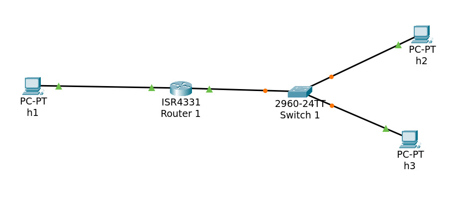 
    <em>Figura 1: Diagrama de red propuesto en Packet Tracer.</em>

**3)** Los simuladores son herramientas diseñadas para reproducir el comportamiento de sistemas reales o abstractos con el propósito de facilitar su comprensión y aprendizaje. Aunque pueden modelar el funcionamiento de un sistema, no necesariamente replican su estructura interna. Por ejemplo, un simulador de tráfico puede representar el movimiento de los vehículos en una ciudad sin reproducir el hardware involucrado.

Por otro lado, los emuladores permiten ejecutar software destinado a una plataforma específica en un entorno diferente, garantizando la compatibilidad entre sistemas. Su función es recrear tanto el software como el hardware del sistema original, imitando aspectos como la arquitectura del procesador, la memoria y otros componentes. Un ejemplo común es el emulador de consolas retro, que posibilita la ejecución de videojuegos antiguos en computadoras modernas. A diferencia de los simuladores, los emuladores buscan replicar con precisión la plataforma original, permitiendo que el software funcione como lo haría en su entorno nativo.

**4)** Para evaluar la conectividad entre los dispositivos en la red configurada, realizamos pruebas de conectividad enviando paquetes ICMPv4 mediante el comando `ping` a las direcciones IP de los distintos hosts.

    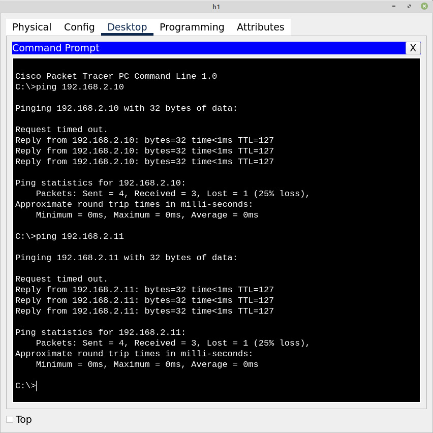 
    <em>Figura 2: Comando ping desde h1.</em>

Los resultados obtenidos en la prueba de conectividad con ICMPv4 fueron que se enviaron 4 paquetes, de los cuales 3 fueron recibidos correctamente y 1 se perdió, resultando en una pérdida del 25%. En ambos casos, el tiempo de ida y vuelta de los paquetes recibidos fue 0 ms y el TTL (Time To Live) de las respuestas de los hosts de destino fue 127 (indicando que los dispositivos se encontraban a un solo salto de distancia).

**5)** Para la evaluación de la conectividad en IPv6, realizamos pruebas enviando los paquetes ICMPv6 a cada host de la red, mediante el comando `ping` (y no `ping6`). 

    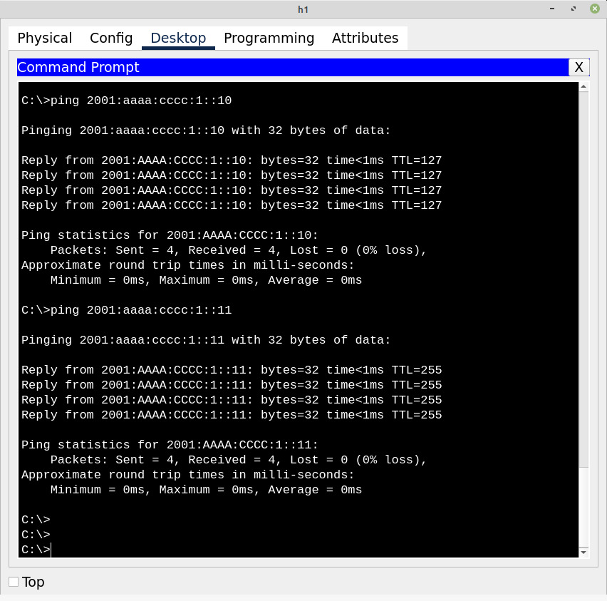 
    <em>Figura 3: Comando ping desde h1.</em>

Los resultados obtenidos fueron que la conectividad en la red IPv6 se encuentra en óptimas condiciones, sin pérdidas de paquetes y con un tiempo de ida y vuelta mínimo de 0 ms. En las pruebas de IPv6, el TTL en las respuestas es 255, lo que indica que los dispositivos están dentro de la misma red (a diferencia con las pruebas en IPv4).

**6)** Desde el diagrama de red propuesto, iniciamos el tráfico ICMP para analizarlo sobre las dos redes.

    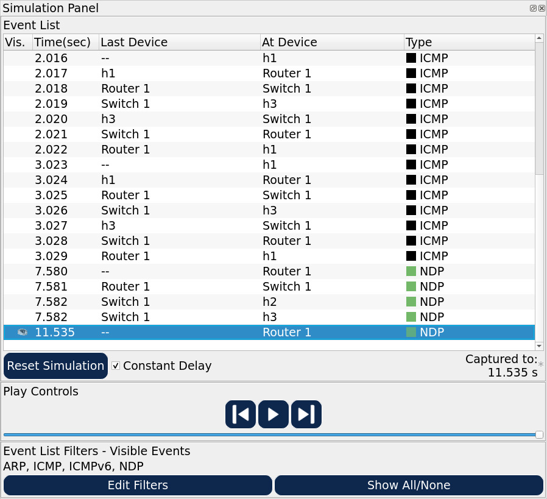 
    <em>Figura 4: Simulación del trafico ICMP.</em>

  1) Pero, antes de iniciar la comunicación ICMP los dispositivos deber realizar una conversión entre direcciones lógicas (IPv4) y direcciones físicas (MAC) que les permitan transmitir los mensajes a los dispositivos correctos dentro de su propia red. Para ello se utiliza el protocolo ARP.

    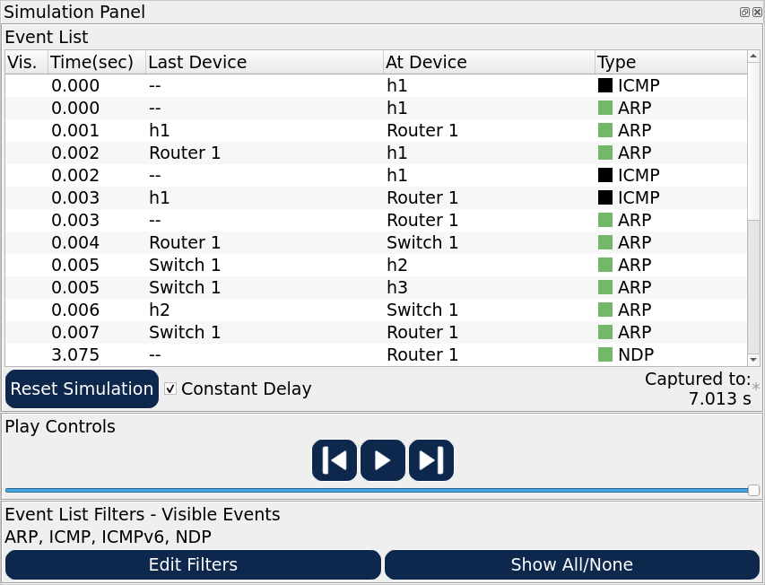 
    <em>Figura 5: Simulación del trafico ARP.</em>

 
El primer mensaje de este tipo lo realiza el host h1 que busca encontrar la dirección MAC de su deafult gateway (router) ya que la dirección IP con la que intenta comunicarse esta fuera de su propia red.

  

      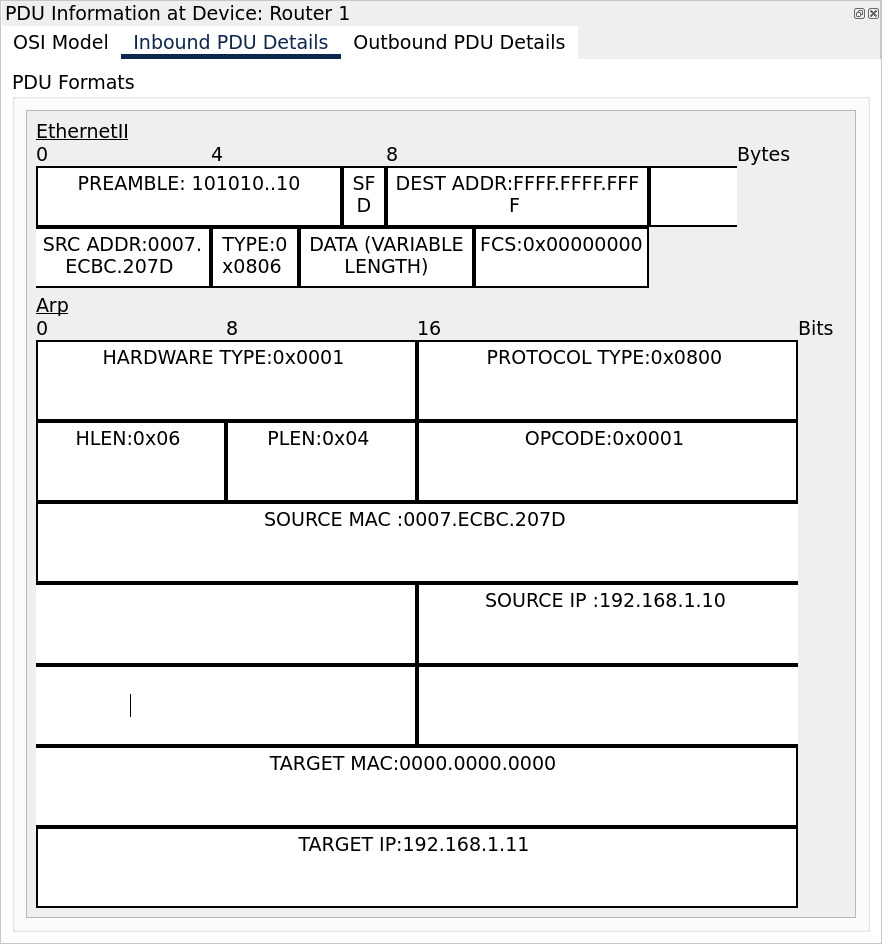 
      <em>Figura 5a: PDU Information Inbound.</em>
  

El router responde este mensaje con su dirección MAC permitiéndole al host conocer la dirección MAC de su default gateway.

  

      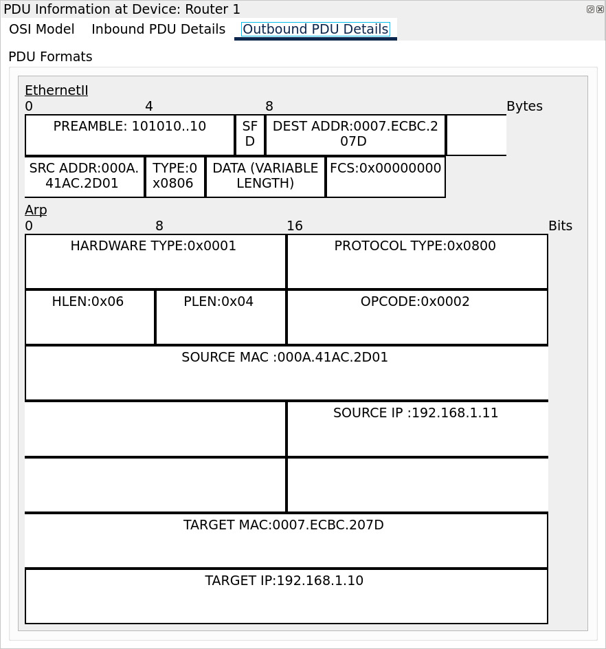 
      <em>Figura 5b: PDU Information Outbound.</em>
   

Cuando llega la solicitud ICMP al router este repite el proceso para obtener la dirección MAC del host de destino, donde el switch retransmite el mensaje ARP a ambos hosts (2 y 3) pero solo el que tiene la dirección IP correcta responde.

  2) Si revisamos nuevamente las figuras 5a y 5b queda claro como en los mensajes ARP las direcciones IPs se dividen en IP de origen y destino, donde la de origen se almacena en el bit 112 del encabezado ARP y la de destino en el bit 192.

  3) Una vez el host 1 sabe que puerto lo conecta al router transmite el paquete ICMP, y el router repite el proceso ARP para obtener la MAC del destino. Basándose en la sub-red de destino el router sabe que debe consultar por su puerto que pertenece a dicha sub-red.

  4) Por último el switch retransmitirá el mensaje al host de destino adecuado ya que habrá completado internamente una tabla con las direcciones MAC de los dispositivos conectados a cada uno de sus puertos. Cabe aclarar que el switch realiza una tarea de retransmisión, no de enrutamiento como el router, por lo que no necesita que se le asigne una dirección IP en sus puertos (De todas formas esto se puede realizar pero su utilidad es solo de brindar acceso remoto al switch).

  5) En la tabla ARP de h1 vemos: la dirección IP, la dirección MAC y el tipo de entrada, en este caso, dinámica.

  

      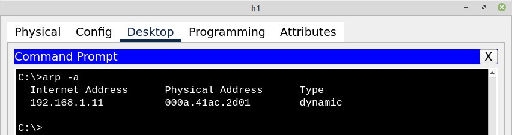 
      <em>Figura 6: Tabla ARP de h1.</em>
  

  Esto indica que el dispositivo h1 aprendió la dirección MAC correspondiente a la IP `192.168.2.10` de manera dinámica a través del protocolo ARP.

  6) En la tabla ARP de h3, vemos los mismo datos que mencionamos anteriormente.

  

      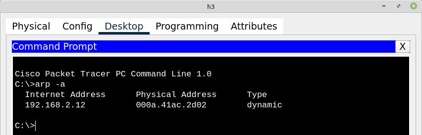 
      <em>Figura 7: Tabla ARP de h3.</em>
  

  7) En la tabla ARP del router vemos las direcciones IP y sus direcciones MAC correspondientes para los dispositivos en la red, asociadas a las interfaces de red del router (GigabitEthernet0/0 y GigabitEthernet0/1). Para esto, utilizamos el comando `show arp`
  
  

      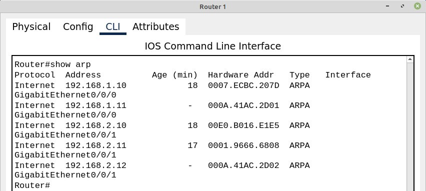 
      <em>Figura 8: Tabla ARP del router.</em>
  

  En este caso, podemos ver que las direcciones IP 192.168.1.10 y 192.168.2.10 tienen direcciones MAC asociadas (0007.ECBC.D7D y 00E0.B016.E1E5, respectivamente).

  8) En el entorno de IPv4, donde las direcciones IP tienen una longitud de 32 bits, una dirección de broadcast se define cuando todos los bits correspondientes al host están en 1. Un ejemplo de esto es 255.255.255.255, que representa el broadcast universal. Sin embargo, existe un aspecto clave a considerar: la dirección de broadcast de una red depende de su dirección IP y de la máscara de subred. 
  Por ejemplo, si una red tiene como gateway predeterminado la dirección 192.168.0.0 y usa la máscara de subred 255.255.255.0, entonces su dirección de broadcast será 192.168.0.255. Cuando un dispositivo envía un mensaje a esta dirección, la comunicación se dirige a todos los dispositivos dentro de la misma red. No obstante, los mensajes de broadcast no pueden atravesar de una red a otra a través de un gateway.

  9) En IPv4, la multidifusión o multicast es un método de transmisión que permite enviar información a un grupo específico de receptores configurados para recibirla. En lugar de enviar múltiples copias individuales, el emisor transmite los datos una sola vez a una dirección de multicast, y la red se encarga de distribuirlos eficientemente a todos los destinatarios dentro del grupo.
  Este tipo de tráfico es especialmente útil para la distribución masiva de datos, permitiendo que un único flujo llegue simultáneamente a múltiples dispositivos. Se emplea comúnmente en aplicaciones de transmisión multimedia, como streaming de video y música, así como en videoconferencias y en la distribución de configuraciones o actualizaciones a varios dispositivos dentro de una red local.

**7)** A continuación iniciamos tráfico ICMPv6 (ping IPv6) entre h1 a h3.

      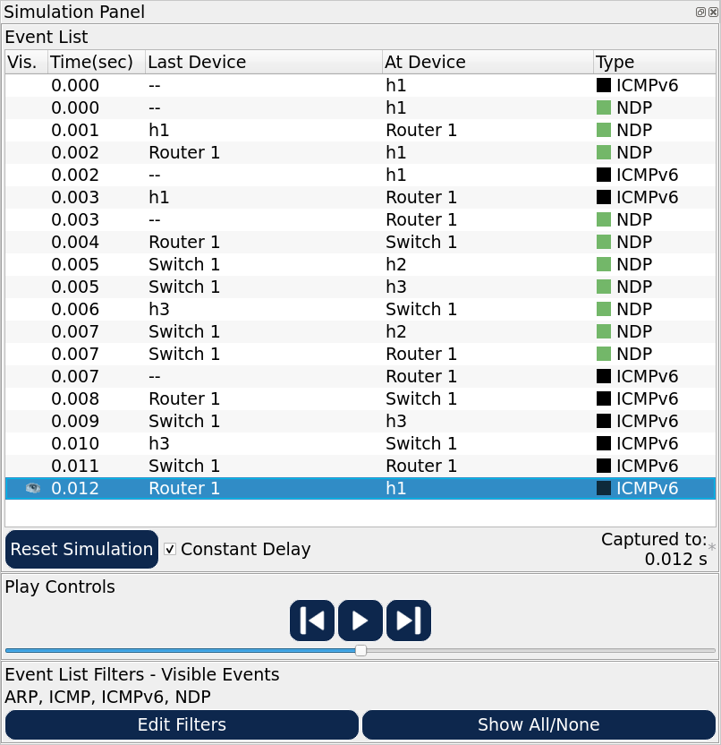 
      <em>Figura 9: Tráfico NDP/ICMPv6 generado de h1 a h2.</em>
  

  1) El primer mensaje NDP que ocurre se da desde el host h1 al router, su PDU es la siguiente.

      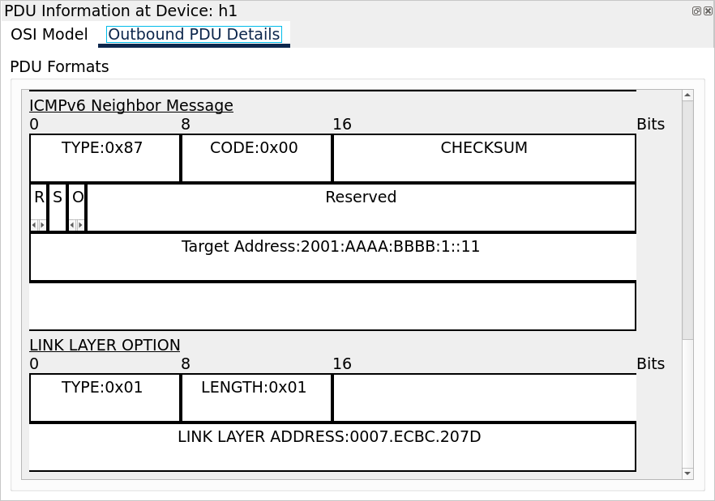 
      <em>Figura 10: PDU NDP Solicitud de vecino.</em>
  

En la casilla type (primero 8 bits) se encuentra el código 0x87, este código hexadecimal se traduce a 135 decimal, que es el código usado para representar las **solicitudes de vecino**. Específicamente el host está solicitando la dirección física del dispositivo de IP 2001:AAAA:BBBB:1::11 (bits 64-96) que se corresponde a su default gateway.

Analizando la PDU IPv6 se destaca que la dirección de destino es FF02::1:FFOO:11, esto es una dirección multicast donde los dígitos 00:11 al final indican los últimos 24 bits de la IPv6 que se está buscando, así se reduce el procesamiento que los hosts deben realizar del paquete (aquellos cuya IP no coincida con esos 24 bits descartan el paquete inmediatamente).

      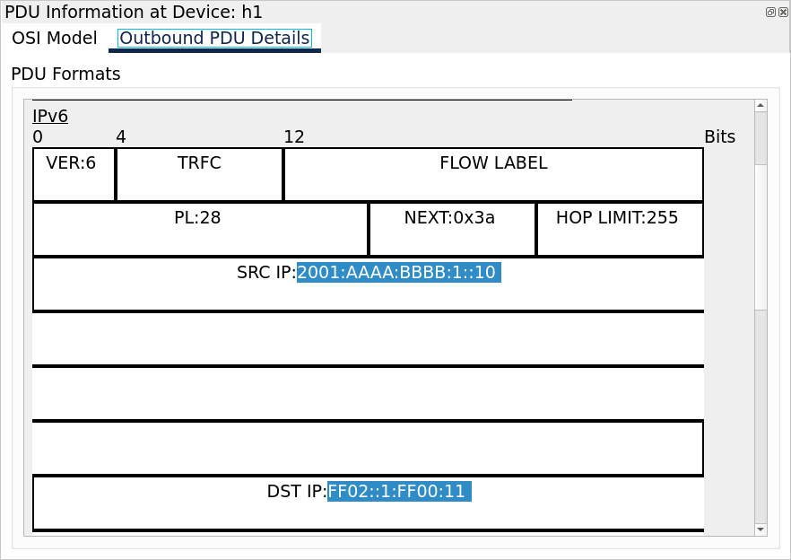 
      <em>Figura 11: PDU IPv6 multicast.</em>
  

El router responde a la solicitud con un anuncio de vecino (type 0x88) indicando su dirección MAC. Este mensaje se envía como un unicast IPv6 al mismo host que hizo la solicitud.

      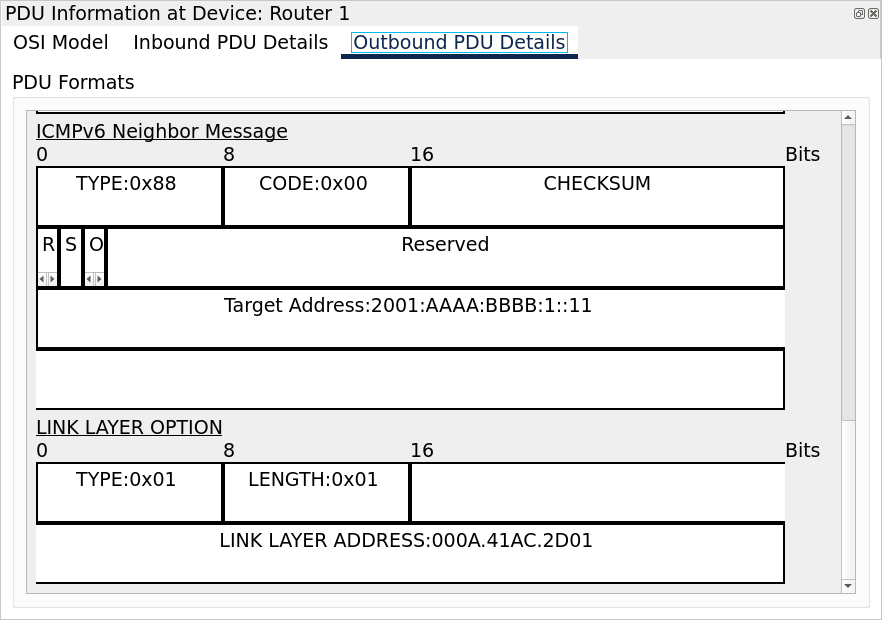 
      <em>Figura 12: PDU NDP Anuncio de vecino.</em>
  

Luego, cuando el mensaje ICMPv6 llega al router este repite el procedimiento para encontrar al host 3. Cuando la solicitud multicast llega al host 2 este la descarta automáticamente por no pertenecer al grupo multicast.

  2) NDP es el protocolo que reemplaza a ARP en redes IPv6. Este presenta además mejoras de rendimiento al usar multicast en lugar de broadcast reduciendo el tráfico en la red.

  3) El protocolo NDP cuenta con las siguientes funciones principales
     - Descubrimiento de vecinos: Permite a un host identificar la MAC de otro nodo en la misma red mediante el intercambio de mensajes (Neighbor Solicitation y Neighbor Advertisement)
     - Descubrimiento de routers: Los hosts pueden detectar la presencia de routers locales a través de mensajes Router Solicitation (iniciado por el host) y Router Advertisement (emitido por los routers). 
     - Autoconfiguracion sin estado (SLAAC): Permite que un host configure su dirección IPv6 de forma automática sin necesidad de un servidor DHCP, basándose en la información recibida en los mensajes de Router Advertisement.
     - Detección de duplicados (DAD): Antes de asignar una dirección, el host verifica que ésta no esté ya en uso en el enlace, evitando conflicto de direcciones.
     - Redirección: Los routers pueden informar a los hosts sobre rutas más óptimas para llegar a ciertos destinos a través de mensajes de redirección

  4) La funcion de broadcast en IPv6, es reemplazada por el **Multicast**

  5) La principal diferencia entre `Link-local`, `Unique-local` y `Global` esta en su uso específico.
     - Link-local: Se usa para la comunicación en el mismo enlace. Estas direcciones se configuran de forma auttomática (usando el prefijo fe80::/10) y no se enrutan fuera del enlace local. _Ejemplo de uso:_ Se utiliza esencialmente para la ejecución de NDP, autoconfiguracion y otras operaciones básicas como el descubrumiento de vecinos en la red local.
     - Unique-local: Son similares a las direcciones privadas en IPv4. Se utilizan en redes internas o en entornos de múltiples sitios, pero no son enrutables en internet. Generalmente utilizan el prefijo fd00::/8. _Ejemplo de uso:_ En una empresa, se puede utilizar para la comunicación interna entre servidores y estaciones de trabajo sin exponer estas comunicaciones a la red pública.
     - Global: Son direcciones únicas y enrutables a nivel mundial, asignadas por IANA y distribuidas por los registrios regionales de internet. Estas direcciones pertenecen al rango 2000::/3. _Ejemplo de uso:_ Se utilizan cuando un dispositivo debe comunicarse a través de internet, garantizando una direccion única y accesible globalmente.

---

# Parte II - Manejo de equipamiento físico, recuperación de contraseñas de equipos de red y establecimiento de red y análisis de tráfico.

## Resumen

En esta segunda parte del trabajo práctico N°1, el objetivo es configurar y administrar un switch Cisco Catalyst 2950 [1]. Establecer conexión mediante PUTTY, modificando claves de acceso y realizar pruebas de conectividad. Además, se analizará el tráfico de red, evaluando protocolos como ARP, NDP e ICMP, y configurando DHCP y mirroring de puertos para monitoreo.

**Palabras clave**: _Switch Cisco Catalyst 2950, administración, contraseñas, ARP, NDP, ICMP, DHCP, configuración de red, análisis de tráfico, mirroring de puertos_

---

## Introducción

El objetivo de este trabajo es el manejo de equipamiento físico de red, incluyendo la configuración y administración de un switch empresarial. A lo largo de las actividades, se busca desarrollar habilidades en la conexión y configuración de dispositivos, recuperación de claves de acceso, establecimiento de redes y análisis de tráfico. Se emplearán herramientas como PUTTY y hardware específico para realizar pruebas de conectividad y monitoreo de tráfico.

---

# Metodología

## Consignas

**1)** El **Cisco Catalyst 2950** es un switch gestionado de 10/100 Mbps, diseñado para redes pequeñas y medianas. Algunas de sus principales características son:
  - **Puertos:** Modelos con 12, 24 o 48 puertos Fast Ethernet (10/100 Mbps), algunos con puertos Gigabit Ethernet adicionales.
  - **Administración:** Soporta administración web (Cisco Device Manager), CLI y Simple Network Management Protocol (SNMP) para gestión remota.
  - **Seguridad:** Implementa autenticación 802.1x, seguridad basada en direcciones MAC y protocolos de gestión segura como Secure Shell (SSHv2) y SNMPv3.
  - **Rendimiento:** Arquitectura de conmutación de hasta 13.6 Gbps, con capacidad de reenvío a velocidad de línea.
  - **Funciones avanzadas:** VLANs, Quality of Service (QoS), Spanning Tree Protocol (STP), mirroring de puertos (SPAN) y soporte para multicast (IGMP snooping).
  - **Administración de energía:** Compatible con Cisco RPS (Redundant Power System) para respaldo de energía.

**2)** Estos son los procedimientos sugeridos:
   - **Para el paso a):**
   - Reunir el material necesario (cable de consola RJ-45, usb a RS-232 y PuTTY instalado).
   - Conectar el cable de consola al puerto CONSOLE del switch, y el otro extremo a la PC.
   - Verificar el puerto COM asignado, abriendo el administrador de dispositivos y buscando en Puertos el puerto asignado (ej: COM3).
   - Abrir PuTTY y en la seccion de Connection type seleccionar Serial. En Serial line escribir el numero del puerto COM asignado y en Speed (baud rate) escribir 9600. Configurar los parametros de 
     - Baud rate: 9600, 
     - Data bits: 8, 
     - Parity: None, 
     - Stop bits: 1, 
     - Flow control: None 
     - Y hacer clic en Open.
   - Verificar la conexion, si la pantalla esta en negro, presionar Enter; y si aparecen caracteres extraños, cerrar PuTTY y verificar la configuracion.
   - **Para el paso b):**
   - Acceder al switch por consola en PuTTY, apretando Enter accedemos al CLI.
   - Escribir el comando ``enable`` para entrar en modo privilegiado.
   - Escribir el comando ``configure terminal`` para entrar en modo de configuracion global (el prompt deberia verse como ``Switch(config)#``).
   - Escribir el comando ``enable secret CLAVE_NUEVA`` para configurar la clave de acceso al modo privilegiado.
   - Escribir el comando ``line console 0`` para acceder a la linea de consola y luego asi configurar la clave de acceso a la consola, entonces ingresar el comando ``password CLAVE_CONSOLA``.
   - Habilitar el inicio de sesion con clave con el comando `login`.
   - Para salir al modo global, usar el comando `exit`.
   - Para guardar los cambios en la configuracion, escribir el comando `write memory` y salir al modo usuario con el comando `exit`.
   - **Para el paso c):**
   - Reunir el material necesario (cable de consola RJ-45, cables Ethernet).
   - Conectar las PCs al switch con los cables Ethernet y verificar que las luces de los puertos del switch se enciendan.
   - Configurar direcciones IP en las PCs:
     - PC1 IP: 192.168.1.10
     - PC1 Mascara: 255.255.255.0
     - PC2 IP: 192.168.1.11
     - PC2 Mascara: 255.255.255.0
   - Opcional: Crear una VLAN en el switch. Escribir el comando ``configure terminal`` para entrar en modo de configuracion global y crear una VLAN con los comandos ``vlan 10`` seguido de `exit`. Asignar los puertos de las PCs a VLAN10 con los comandos `interface fastEthernet 0/1`, `switchport mode access`, `switchport access vlan 10` y `exit` (cambiar 0/1 por 0/2 para la otra PC). Finalmente `write memory`.
   - Probar la conectividad. Desde la PC1, escribir el comando `ping 192.168.1.11` y desde la PC2, escribir el comando `ping 192.168.1.10`.
   - En cada PC, ejecutar el comando `arp -a` para mostrar las direcciones MAC de una PC en la misma red.
   - **Para el paso d):**
   - Reunir el material necesario (tres PCs, cables Ethernet y Wireshark).
   - Configurar morroring en el switch desde la PC conectada a consola. Escribir el comando `configure terminal` para acceder a la configuracion global.
   - Definir el puerto de origen (de PC1 a PC2) con el comando `monitor session 1 source interface fastEthernet 0/1`.
   - Definir el puerto de destino (PC3) con el comando `monitor session 1 destination interface fastEthernet 0/3`.
   - Guardar la configuracion con `write memory`.
   - Capturar el trafico con Wireshark. En la PC3, abrir Wireshark y seleccionar la interfaz de red conectada al switch. Iniciar la captura y observar los paquetes entre PC1 y PC2.
   - Hacer uso del comando `ping` entre PC1 y PC2, para verificar en Wireshark que los paquetes aparecen como ICMP.
- monitor session 1 destination interface fastEthernet 0/3

**3)** HACER Llevar a cabo las actividades 3.a 3.b, 3.c y 3.d de la parte 1 y documentar los resultados.

## Resultados

Lorem ipsum dolor sit amet, consectetur adipiscing elit. Sed tempor, mauris sit amet aliquet vestibulum, enim ante consectetur enim, vel sollicitudin odio risus vel libero. Integer eget ipsum sed eros luctus laoreet vel vel leo. Fusce ut dapibus nisl. Aliquam erat volutpat. Donec in elit non justo convallis vestibulum.

---

## Discusión y conclusiones

Lorem ipsum dolor sit amet, consectetur adipiscing elit. Sed tempor, mauris sit amet aliquet vestibulum, enim ante consectetur enim, vel sollicitudin odio risus vel libero. Integer eget ipsum sed eros luctus laoreet vel vel leo. Fusce ut dapibus nisl. Aliquam erat volutpat. Donec in elit non justo convallis vestibulum.

## Referencias

[1] CISCO CATALYST 2950 SERIES SWITCHES WITH STANDARD IMAGE SOFTWARE [Cisco Systems](https://teamkci.com/wp-content/uploads/WS-C2950.pdf)
