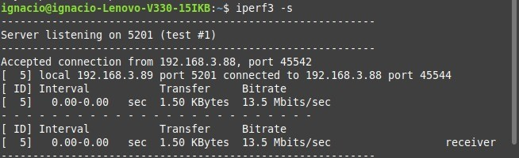
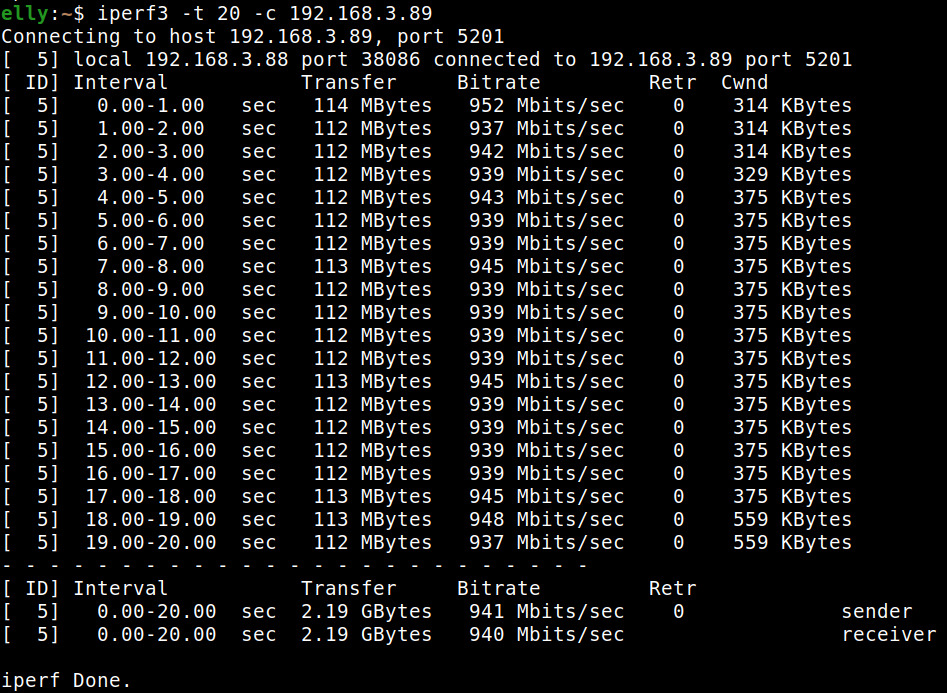
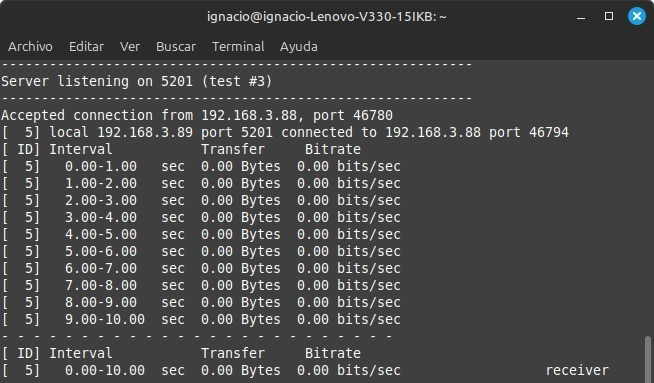

# Trabajo Práctico N°2
# Topologias multi-path y evaluacion de performance en redes

**Nombres**  
_Elly I Esparza;_  
_Federica Mayorga;_  
_Ignacio Delamer;_  
_Ignacio A Rivarola_  
**Wi-Fighters**

**Universidad Nacional de Córdoba - FCEFyN**  
**Redes de Computadoras**  
**Profesores**  
Facundo N Oliva Cuneo  
Santiago M Henn  
**Fecha**
10/04/25  

---

### Información de los autores
 
- **Información de contacto**: _elly.indra.esparza@mi.unc.edu.ar_,  _federica.mayorga@mi.unc.edu.ar_,  _ignaciodelamer@mi.unc.edu.ar_,  _ignacio.rivarola@mi.unc.edu.ar_  

---

## Resumen
El TPN2 propone el diseño e implementación de una topología de red física multi-path entre varios grupos, usando equipamiento de laboratorio (PCs, switches y routers). Las tareas incluyen configuracion IP fija en cada dispositivo, el uso de **iperf3** para realizar pruebas de rendimiento, capturar y analizar tráfico con **Wireshark** y elaborar conclusiones en base a las mediciones recolectadas.  

**Palabras clave**: _Topología, enrutamiento, multi-path, iperf3, wireshark, TCP, UDP, ancho de banda, captura de trafico, performance_.

---

## Introducción
En este trabajo práctico se abordan conceptos fundamentales de enrutamiento y análisis de rendimiento en redes informáticas, aplicando configuraciones tanto estáticas como dinámicas. El enfoque principal está puesto en el diseño y evaluación de topologías de red físicas con multi-path, utilizando herramientas como **iperf3** y **Wireshark** para realizar mediciones y observar el comportamiento del tráfico. Se busca integrar conocimientos teóricos con la práctica en laboratorio, trabajando en conjunto para construir una red compleja y compartida entre grupos.

---

# Metodología

## Consignas

**1)**  
   Para cumplir con esta consigna, se configuraron las siguientes direcciones IP fijas en nuestras computadoras del grupo:
   - **PC1:** _192.168.3.88_
   - **PC2:** _192.168.3.89_  
  
  Se realizaron pruebas de conectividad con el comando `ping` con otros hosts dentro del mismo grupo, como de otros grupos (IP del hosts perteneciente a otro grupo es _192.168.3.100_).

  

     
    <em>Figura 1: ping de PC1 a PC2.</em>
  

  

     
    <em>Figura 2: ping de PC2 a PC1.</em>
  

  Se observa conectividad estable, sin perdida de paquetes y con tiempos similares.  

  En ambas PCs del grupo, se repitio el proceso a la IP del host de otro grupo:

  

     
    <em>Figura 3: ping de PC1 a otro host.</em>
  

  

     
    <em>Figura 4: ping de PC2 a otro host.</em>
  

  Se logro una respuesta positiva, sin perdida de paquetes. Los tiempos de respuesta fueron un poco más altos en comparacion entre PC1 y PC2, lo cual es esperable por el mayor recorrido dentro de la red.

**2)**
  
  Para realizar estas pruebas, es necesario tener una PC como **servidor** y otra como **cliente**. En este caso, la direccion IP del servidor fue _192.168.3.89_ (PC2) y la del cliente fue _192.168.3.88_ (PC1).

  En el servidor, se ejecuta el comando ``iperf3 -s``, como se observa en la imagen.
    
  

     
    <em>Figura 5: PC2 como servidor.</em>
  

  En el cliente, se ejecuta el comando ``iperf3 -c 192.168.3.89``, como se observa en la imagen.

  

     
    <em>Figura 6: PC1 como cliente.</em>
  

  Esto realiza una prueba utilizando el protocolo TCP durante 10 segundos, con un tamaño estandar y sin limitar el ancho de banda.

  Para realizar la prueba a), como iperf3 ya utiliza TCP por defecto, solo seria necesario hacer la prueba de UDP, utilizando el comando ``iperf3 -u -c 192.168.3.89``, como se observa en la imagen.

  

     
    <em>Figura 7: Prueba de UDP desde el cliente.</em>
  

  

     
    <em>Figura 8: Prueba de UDP desde el servidor.</em>
  

  Para realizar la prueba b), se puede definir la cantidad de paquetes con la opcion ``-k`` (blockcount), en nuestro caso a 7 y también, modificar el tamaño del buffer usando la opcion ``-l`` (length), a 256 bytes.

  

     
    <em>Figura 9: Prueba de número y tamaño de paquetes desde el cliente.</em>
  

  

     
    <em>Figura 10: Prueba de número y tamaño de paquetes desde el servidor.</em>
  

  Para realizar la prueba c), se puede ajustar el tiempo de duración en segundos de la prueba con la opcion ``-t`` (time), en nuestro caso de 20 segundos.

  

     
    <em>Figura 11: Prueba de tiempo en el cliente.</em>
  

  

     
    <em>Figura 12: Prueba de tiempo en el servidor.</em>
  

  Y finalmente, para realizar la prueba d), se puede limitar o simular un ancho de banda con la opcion ``-b`` (bandwidth), en nuestro caso de 5 bits/seg.

  

     
    <em>Figura 13: Prueba de ancho de banda en el cliente.</em>
  

  

     
    <em>Figura 14: Prueba de ancho de banda en el servidor.</em>
  

1) HACER Configurar Wireshark (o algún software de sniffing similar) para filtrar tráfico basándose en las IPs de partida/destino. Capturar tráfico y ejecutar pruebas con un host (pc) como servidor y otro como cliente, con distintas configuraciones de protocolos y configuraciones entre:  
    a) Dos computadoras en un mismo grupo (no olvidar configurar el capturador en loopback)  
    b) Una computadora de un grupo y computadoras de al menos otros 2 (dos) grupos  

Documentar capturas de wireshark y las consolas corriendo iperf.

4) HACER Elaborar conclusiones sobre los siguientes aspectos:
¿Cuál es el ancho de banda promedio de la prueba? ¿Cuánto duró la prueba? ¿Cuál es el tamaño promedio de paquetes? ¿Observas alguna diferencia entre UDP y TCP?¿Observamos relación entre alguno de los parámetros de la prueba y la pérdida de paquetes?

5) HACER Ejecutar una prueba como cliente desde una computadora del grupo hacia un servidor propuesto en clase.
Documentar los resultados y elaborar conclusiones sobre los aspectos del punto 4, además de comparar
con los resultados de las pruebas del punto 3)

## Resultados

## Discusión y conclusiones

Lorem ipsum dolor sit amet, consectetur adipiscing elit, sed do eiusmod tempor incididunt ut labore et dolore magna aliqua. Ut enim ad minim veniam, quis nostrud exercitation ullamco laboris nisi ut aliquip ex ea commodo consequat. Duis aute irure dolor in reprehenderit in voluptate velit esse cillum dolore eu fugiat nulla pariatur. Excepteur sint occaecat cupidatat non proident, sunt in culpa qui officia deserunt mollit anim id est laborum.

## Referencias

[1] iPerf 3 user documentation [Dugan, Elliott, Mah, Poskanzer, Prabhu]([link](https://iperf.fr/iperf-doc.php))
