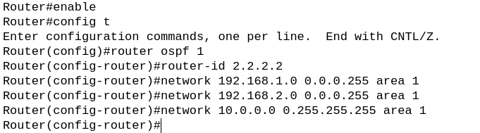
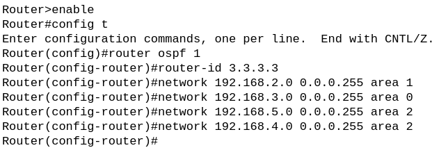
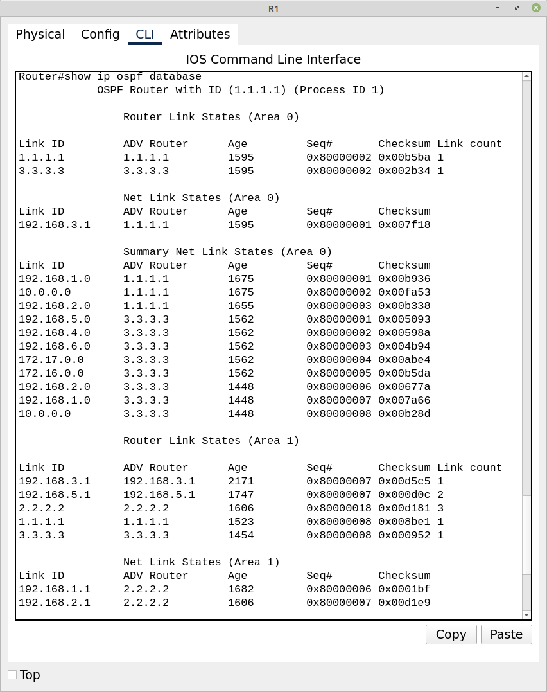

# Trabajo Práctico N°3
# Performance de redes y ruteo interno dinámico.

**Nombres**  
_Elly I Esparza;_  
_Federica Mayorga;_  
_Ignacio Delamer;_  
_Ignacio A Rivarola_  
**Wi-Fighters**

**Universidad Nacional de Córdoba - FCEFyN**  
**Redes de Computadoras**  
**Profesores**  
Facundo N Oliva Cuneo  
Santiago M Henn  
**Fecha**
24/04/25  

---

### Información de los autores
 
- **Información de contacto**: _elly.indra.esparza@mi.unc.edu.ar_,  _federica.mayorga@mi.unc.edu.ar_,  _ignaciodelamer@mi.unc.edu.ar_,  _ignacio.rivarola@mi.unc.edu.ar_  

---

## Resumen
El objetivo de este trabajo práctico se centra en la evaluación de performance y la configuración de ruteo interno dinámico mediante el protocolo **OSPF** (Open Shortest Path First) en un entorno virtual (Packet Tracer, en nuestro caso). Incluye desde la teoría básica de **OSPF** y algoritmos de shortest path, pasando por el diseño de un esquema de direccionamiento **IP**, hasta la puesta en marcha completa de la red: configuración de routers, verificación de vecinos y **LSDB**, ajuste de costos, redistribución de rutas y análisis de fallos. Finalmente, se comparan las tablas **RIB** y **FIB** y se documenta el impacto de las caídas de enlace.  

**Palabras clave**: _OSPF (Open Shortest Path First), IGP (Interior Gateway Protocol), Teoría de grafos, Algoritmo de Dijkstra, RIB, FIB, Costos OSPF, Redistribución de rutas, Packet Tracer_.

---

## Introducción
En entornos de redes de gran escala y alta disponibilidad, la elección de un protocolo de ruteo dinámico eficiente es fundamental. **OSPF** es un protocolo de enlace de estado diseñado para **IP** que ofrece rápida convergencia, escalabilidad mediante áreas y métricas basadas en costos. Basado en la teoría de grafos, **OSPF** modela la red como un grafo donde cada router intercambia información de estado de enlace (**LSDB**) con sus vecinos, y calcula rutas óptimas usando el algoritmo de Dijkstra. En este trabajo práctico se desarrolla desde la teoría hasta la implementación en un simulador, incluyendo el diseño de un esquema de direccionamiento **IP** que separa eficientemente las subredes de hosts y los enlaces punto a punto, la configuración completa de routers, la verificación y ajuste de parámetros **OSPF**, la redistribución de rutas predeterminadas y el análisis de la resiliencia ante fallos.

---

# Metodología

## Consignas

1)  
Open Shortest Path First (**OSPF**) es un protocolo de enrutamiento dinámico de tipo Interior Gateway Protocol (**IGP**), diseñado específicamente para redes **IP**. Desarrollado por el grupo de trabajo **OSPF** de la **IETF**, su versión más conocida y utilizada es la versión 2 (definida en el **RFC 2328**), especialmente implementada en entornos Cisco. **OSPF** permite el enrutamiento dentro de un sistema autónomo mediante un enfoque jerárquico basado en áreas y tiene la capacidad de manejar redes complejas, redistribuir rutas desde otros protocolos, autenticar paquetes y optimizar el uso del ancho de banda utilizando **IP** multicast.

Desde el punto de vista teórico, **OSPF** está fuertemente basado en la teoría de grafos. La red se representa como un grafo dirigido y ponderado, donde:
- Cada router es un nodo.
- Cada enlace entre routers es una arista con un peso (costo) asociado.

Para determinar la mejor ruta a cada destino, **OSPF** utiliza el algoritmo de Dijkstra, también conocido como Shortest Path First (**SPF**). Este algoritmo encuentra el camino más corto desde un nodo origen (el router) hacia todos los demás nodos del grafo (la red), tomando como criterio de optimización el menor costo acumulado.


El proceso para encontrar los caminos más cortos con el algoritmo de Dijkstra es el siguiente:
- Se inicializa la distancia del nodo origen en 0 y todas las demás distancias en infinito.
- Se introduce el nodo origen en una estructura eficiente como un min heap (cola de prioridad) con la forma <distancia, nodo>.
- Se extrae el nodo con menor distancia del heap.
- Para cada vecino del nodo actual:
    - Se calcula la nueva distancia: ``dist[v] = dist[u] + peso[u][v]``
    - Si la nueva distancia es menor a la registrada, se actualiza y se reintroduce en el heap.
- Este proceso se repite hasta que el heap esté vacío.
- El resultado es una tabla con la menor distancia desde el origen a cada nodo.

**OSPF** aplica este algoritmo sobre su base de datos de estado de enlace (**LSDB**) para generar la tabla de enrutamiento más eficiente posible.

En cuanto al direccionamiento **IP**, **OSPF** opera sobre redes **IP** divididas en clases, aunque en la práctica moderna se utiliza subneteo sin depender estrictamente de las clases originales:
- **Clase A (rango 0.0.0.0 a 127.255.255.255):** para grandes redes con muchos hosts.
- **Clase B (rango 128.0.0.0 a 191.255.255.255):** para redes medianas.
- **Clase C (rango 192.0.0.0 a 223.255.255.255):** para redes pequeñas, comúnmente usada para enlaces entre routers por su tamaño reducido.

**OSPF** distingue varios tipos de redes físicas y lógicas, lo que permite optimizar su funcionamiento en cada caso:
- Redes broadcast (Ethernet, **FDDI**)
- Redes **NBMA** (non-broadcast multi-access) como Frame Relay
- Redes punto a punto (**PPP**, **HDLC**)
- Redes punto a multipunto, una mezcla entre **NBMA** y punto a punto, útil en topologías parcialmente malladas

Cada tipo tiene implicancias sobre cómo se detectan los vecinos y cómo se elige el router designado (**DR**).
   
2)  
En este esquema de direccionamiento, hemos seleccionado la red ``10.0.0.0/8`` (Clase A) para la **LAN** de hosts conectados al switch 1 porque su amplio espacio de direcciones (más de 16 millones de direcciones útiles) permite un crecimiento futuro sin necesidad de re enumerar subredes; además, al usar la máscara por defecto simplificamos la configuración inicial de los dispositivos. 

Para diferenciar las redes en las otras redes de hosts se usarán las redes clase B ``172.16.0.0/16`` y ``172.17.0.0/16``

Por otro lado, para los enlaces punto a punto entre routers usamos redes clase C de la ``192.168.1.0/24`` a la ``192.168.6.0/24``, ya que una red que solo requiere dos direcciones efectivas no justifica desperdiciar un rango grande de direcciones. Esta segmentación de la Clases A y B para LAN de usuarios y la Clase C para interconexiones de routers minimiza el desperdicio de espacio de direcciones y mantiene las tablas de enrutamiento claras y escalables.

| Dispositivo | Interfaz | IP | Máscara | Red |
| --- | --- | --- | --- | --- |
| PC1 | F0 | 10.0.0.2 | 255.0.0.0 | 10.0.0.0 |
| PC2 | F0 | 10.0.0.3 | 255.0.0.0 | 10.0.0.0 |
| PC3 | F0 | 10.0.0.4 | 255.0.0.0 | 10.0.0.0 |
| PC4 | F0 | 172.17.0.2 | 255.0.0.0 | 172.17.0.0 |
| PC5 | F0 | 172.16.0.2 | 255.0.0.0 | 172.16.0.0 |
| R1 | Loopback0 | 1.1.1.1 | 255.255.255.255 | 1.1.1.1 |
| R1 | G0/0 | 192.168.1.2 | 255.255.255.0 | 192.168.1.0 |
| R1 | G0/1 | 192.168.3.2 | 255.255.255.0 | 192.168.3.0 |
| R2 | G0/0 | 10.0.0.1 | 255.0.0.0 | 10.0.0.0 |
| R2 | G0/1 | 192.168.1.1 | 255.255.255.0 | 192.168.1.0 |
| R2 | G0/2 | 192.168.2.1 | 255.255.255.0 | 192.168.2.0 |
| R3 | G0/0 | 192.168.2.2 | 255.255.255.0 | 192.168.2.0 |
| R3 | G0/1 | 192.168.3.1 | 255.255.255.0 | 192.168.3.0 |
| R3 | G0/2 | 192.168.4.1 | 255.255.255.0 | 192.168.4.0 |
| R3 | G0/1/0 | 192.168.5.1 | 255.255.255.0 | 192.168.5.0 |
| R4 | G0/0 | 192.168.6.1 | 255.255.255.0 | 192.168.6.0 |
| R5 | G0/2 | 172.17.0.1 | 255.255.0.0 | 172.17.0.0 |
| R4 | G0/1/0 | 192.168.5.2 | 255.255.255.0 | 192.168.5.0 |
| R5 | G0/0 | 192.168.4.2 | 255.255.255.0 | 192.168.4.0 |
| R5 | G0/1 | 172.16.0.1 | 255.255.0.0 | 172.16.0.0 |
| R5 | G0/2 | 192.168.6.2 | 255.255.255.0 | 192.168.6.0 |

<p align="center">
      <br>
      <em>Figura 1: Diagrama de la red.</em>
  </p>

3)  
Para configurar los routers para utilizar OSPF lo primero a realizar es configurar las direcciones IP de cada puerto. Por ejemplo con el router R2 hacemos:

<p align="center">
      <br>
      <em>Figura 2: Configuración IP router R2.</em>
  </p>

Lo mismo se hace con los demás routers. En particular en el router R1 hay que configurar una interfaz de loopback, esto se realiza de la misma manera que con las demás interfaces pero indicando el nombre de interfaz Loopback0

<p align="center">
      <br>
      <em>Figura 3: Configuración IP router R1 loopback.</em>
  </p>

Ahora si, para configurar los routers para utilizar OSPF debemos ingresar a la configuración de ospf del router con el comando

```
config terminal
router ospf 1
```

Una vez ingresamos a la configuración de OSPF debemos habilitar ruteo en las redes que se encuentran conectadas a cada router con el comando ``network`` seguido de la red, la "*OSPF wild card*" (que es la máscara de subred con los bits invertidos), y un area que puede ser indicada con un valor decimal o una dirección IP. Por el momento colocamos todas las areas en 0.

<p align="center">
      <br>
      <em>Figura 4: Configuración OSPF router R2.</em>
  </p>

Una vez repetimos este proceso en cada router podemos verificar el funcionamiento correcto haciendo un ping desde un host en una red a un host en otra red.

<p align="center">
      <br>
      <em>Figura 5: Ping desde PC3 (10.0.0.4) a PC4 (172.17.0.2).</em>
  </p>

Podemos ademas verificar que las rutas son **OSPF** verificando las tablas de enrutamiento en los routers.

<p align="center">
      <br>
      <em>Figura 6: Tabla de ruteo Router R3.</em>
  </p>

La letra O al inicio de cada linea indica que es una ruta **OSPF** (Como lo indica la sección *Codes* al inicio del mensaje).

4)  
Para comprender el funcionamiento de **OSPF** y su impacto en la red, se analizaron los tipos de mensajes intercambiados entre routers. **OSPF** utiliza cinco tipos de paquetes principales: _Hello_, _Database Description_ (**DBD**), _Link-State Request_ (**LSR**), _Link-State Update_ (**LSU**) y _Link-State Acknowledgment_ (**LSAck**).

Se utilizó el modo de simulación paso a paso, para identificar los distintos mensajes intercambiados por el protocolo **OSPF**, entre routers.

<p align="center">
      <br>
      <em>Figura 7: Simulacion para los mensajes OSPF.</em>
</p>

Se observó especialmente el intercambio de paquetes _Hello_, que permiten formar y mantener las adyacencias entre routers **OSPF**. También se visualizaron los paquetes **LSU**, que contienen información sobre los cambios de estado de enlaces en la red, fundamentales para mantener actualizadas las bases de datos **LSDB**.

El paquete _Hello_ es el primer tipo de paquete que intercambian los routers, ya que sirve para detectar vecinos en la misma red, verificar la compatibilidad de los parámetros y mantener la adyacencia activa.

<p align="center">
      <br>
      <em>Figura 8: Paquete Hello en R4.</em>
</p>

El paquete _Link-State Update_ contiene la información sobre los enlaces de red que conoce un router. Se utiliza para actualizar la **LSDB** de los vecinos.

<p align="center">
      <br>
      <em>Figura 9: Paquete LSU.</em>
</p>

El paquete _Link-State Acknowledgment_ es el que se envia para confirmar que se recibio el LSU correctamente. **OSPF** es confiable, pero al estar sobre **IP**, que no lo es, necesita asegurarse de que los **LSA** no se pierdan.

<p align="center">
      <br>
      <em>Figura 10: Paquete ACK.</em>
</p>

Mediante estos mensajes, los routers construyen la **LSDB**, consistente en toda el área **OSPF**, permitiendo a cada uno calcular rutas óptimas con el algoritmo de Dijkstra.

5)  
    1)  En cada router se configuró **OSPF** para anunciar sus redes directamente conectadas. Esto se logró usando el comando network dentro del proceso **OSPF**. De esta manera, los routers pueden compartir sus enlaces con el resto de la red, permitiendo la creación de rutas dinámicas, como se pued observar en la _Figura 4_.


    2)  Se utilizó el comando ``show ip ospf database`` para acceder al contenido de la **LSDB** en cada router. Esta contiene información sobre todos los routers y redes conocidas dentro del área **OSPF**, lo que permite que cada router construya su mapa de la red y calcule la ruta óptima.

    Lo que observamos a continuación es antes de la definición de las áreas de OSPF en A y B:

    <p align="center">
      <br>
      <em>Figura 11: Comando de database en R1 previo a la separación de áreas.</em>
    </p>

    Más adelante, veremos el mismo comando, pero con la separación de las áreas propiamente hechas.

6)  
Se definieron dos áreas en la red **OSPF**:
- Área A: conformada por los routers R1 y R2
- Área B: conformada por los routers R3, R4 y R5

A continuación, modificamos la configuración del proceso previo de **OSPF** en cada router para que las interfaces pertenecieran a la área correcta. Esto permite segmentar la red **OSPF** y escalar la red de forma eficiente.

<p align="center">
  <br>
  <em>Figura 12: Configuración para área 1.</em>
</p>

<p align="center">
  <br>
  <em>Figura 13: Configuración para área 1 y área 2.</em>
</p>

<p align="center">
  <br>
  <em>Figura 14: Configuración para área 2.</em>
</p>

Se configuró un enlace virtual entre R1 y R3 para conectar el área 1 con el backbone OSPF (área 0). Aunque el comando ``show ip ospf virtual-links`` no mostró salida en Packet Tracer (por limitaciones del simulador), la funcionalidad del enlace fue verificada mediante el comando ``show ip ospf database``. En R1 se observan LSAs correspondientes a routers de otras áreas, lo que confirma que el backbone es accesible y que el virtual-link está funcionando correctamente.

<p align="center">
  <br>
  <em>Figura 15: Comando de database en R1 posterior a la separación de las áreas.</em>
</p>

   
7)  
HACER Verificar el funcionamiento de OSPF:
    a) En el router R2 consultar la información acerca de los vecinos R1 y R3 de OSPF.
    b) En el router R2 consultar la información sobre las operaciones del protocolo de enrutamiento.

8)  
HACER Configurar el costo de OSPF:
    a) Modificar los costos de las rutas OSPF para observar cómo afecta el funcionamiento del protocolo.
    b) Realizar pruebas entre los clientes de los diferentes routers utilizando traceroute antes y después de la modificación para verificar el funcionamiento.

9)  
HACER Redistribuir una ruta OSPF predeterminada:
    a) Configurar una dirección de loopback en R1 para simular un enlace a un proveedor de servicios de Internet (ISP).
    b) Configurar una ruta estática predeterminada en el router R1.
    c) Incluir la ruta estática predeterminada en las actualizaciones de OSPF enviadas desde el router R1.

10)   
HACER Explicar el impacto en toda la red si se cae una interfaz del router R2 (R2 - R1, R2 - R3, R2 - S1).
    
11)   
HACER ¿La tabla RIB (Routing Information Base) es lo mismo que la tabla FIB (Forwarding Information Base)? Justificar con capturas del práctico.


## Resultados

Lorem ipsum dolor sit amet, consectetur adipiscing elit, sed do eiusmod tempor incididunt ut labore et dolore magna aliqua. Ut enim ad minim veniam, quis nostrud exercitation ullamco laboris nisi ut aliquip ex ea commodo consequat. Duis aute irure dolor in reprehenderit in voluptate velit esse cillum dolore eu fugiat nulla pariatur. Excepteur sint occaecat cupidatat non proident, sunt in culpa qui officia deserunt mollit anim id est laborum.


## Discusión y conclusiones

Lorem ipsum dolor sit amet, consectetur adipiscing elit, sed do eiusmod tempor incididunt ut labore et dolore magna aliqua. Ut enim ad minim veniam, quis nostrud exercitation ullamco laboris nisi ut aliquip ex ea commodo consequat. Duis aute irure dolor in reprehenderit in voluptate velit esse cillum dolore eu fugiat nulla pariatur. Excepteur sint occaecat cupidatat non proident, sunt in culpa qui officia deserunt mollit anim id est laborum.
Lorem ipsum dolor sit amet, consectetur adipiscing elit, sed do eiusmod tempor incididunt ut labore et dolore magna aliqua. Ut enim ad minim veniam, quis nostrud exercitation ullamco laboris nisi ut aliquip ex ea commodo consequat. Duis aute irure dolor in reprehenderit in voluptate velit esse cillum dolore eu fugiat nulla pariatur. Excepteur sint occaecat cupidatat non proident, sunt in culpa qui officia deserunt mollit anim id est laborum.

## Referencias

[1] TITULO [AUTORES](LINK)
