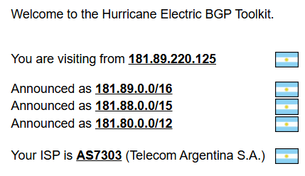
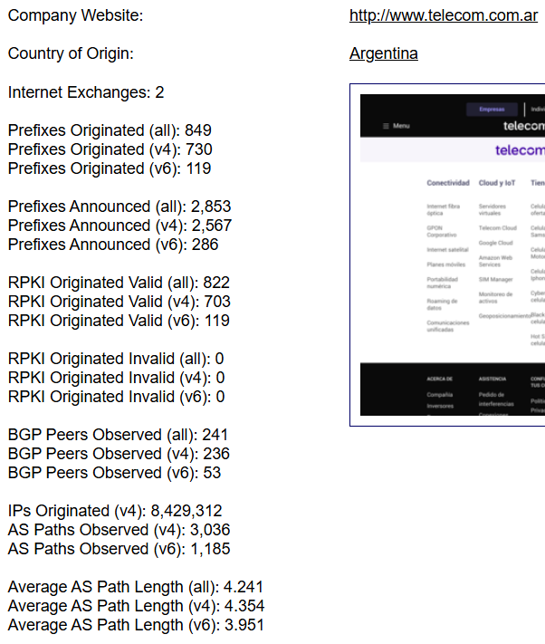
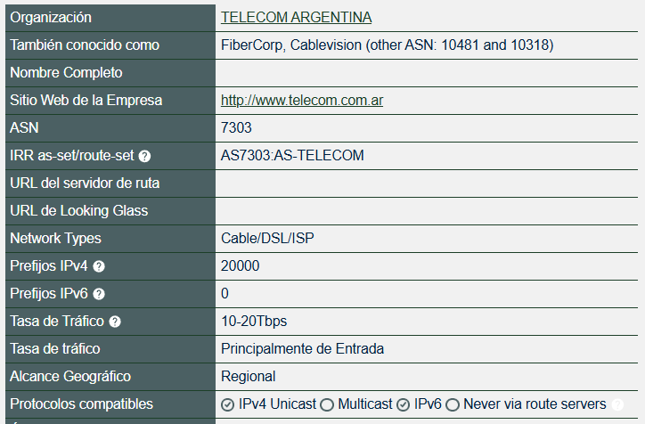
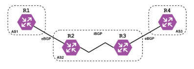

# Trabajo Práctico N°4
# Ruteo externo dinámico y sistemas autónomos.

**Nombres**  
_Elly I Esparza;_  
_Federica Mayorga;_  
_Ignacio Delamer;_  
_Ignacio A Rivarola_  
**Wi-Fighters**

**Universidad Nacional de Córdoba - FCEFyN**  
**Redes de Computadoras**  
**Profesores**  
Facundo N Oliva Cuneo  
Santiago M Henn  
**Fecha**
08/05/25  

---

### Información de los autores
 
- **Información de contacto**: _elly.indra.esparza@mi.unc.edu.ar_,  _federica.mayorga@mi.unc.edu.ar_,  _ignaciodelamer@mi.unc.edu.ar_,  _ignacio.rivarola@mi.unc.edu.ar_  

---

## Resumen  
El objetivo de este trabajo práctico es abordar el estudio del ruteo externo dinámico a través del protocolo **BGP** (Border Gateway Protocol) y su implementación en el contexto de Sistemas Autónomos (**AS**, Autonomous Systems). 

En una primera instancia, se realiza una investigación teórica sobre los conceptos fundamentales, como la definición de **AS**, **ASN**, funcionamiento y tipos de **BGP**, conexiones reales y casos históricos de fallos. 

En la segunda parte, se lleva a cabo una simulación práctica de una red que implementa **BGP**, incorporando **IPv6**, redistribución con **OSPF** y análisis de conectividad y comportamiento ante fallos. Este enfoque integral permite comprender tanto los fundamentos como la aplicación real del **BGP** en entornos de red complejos.

**Palabras clave**: _Border Gateway Protocol (BGP), Autonomous System (AS), ASN, Enrutamiento dinámico, IPv6, OSPF, Simulación de red, Redistribución de rutas, Packet Tracer_.

---

## Parte I - Integración de conceptos, actividades online e investigación  
## Introducción  
El primer apartado del trabajo lleva a comprender los fundamentos teóricos del ruteo entre sistemas autónomos mediante el protocolo **BGP**. Se abordan los conceptos esenciales como qué es un **AS**, cómo se identifican mediante números **ASN**, el funcionamiento del **BGP**, los tipos de mensajes que utiliza, y la diferencia entre **eBGP** e **iBGP**. Además, se analiza la infraestructura real de los **AS** a los que pertenecen distintas conexiones de red y se investiga un caso relevante de fallo en el enrutamiento **BGP**, evaluando su impacto a nivel nacional o internacional.

---

## Consignas

1)  Sobre AS:  
    1) Un _Autonomous System_ (**AS**) es un conjunto grande de redes **IP** interconectadas que operan bajo una única política de enrutamiento y que se identifican de forma unificada hacia el resto de Internet. Es uno de los componentes fundamentales de la arquitectura de Internet, que puede entenderse como una red de redes, donde cada **AS** representa una de esas grandes redes independientes.  
    Cada **AS** tiene asignado un conjunto específico de direcciones **IP**, conocido como su espacio de direcciones **IP**, y administra la entrega de datos dentro de ese espacio. Por fuera de sus límites, se encarga de intercambiar rutas y datos con otros **AS** utilizando protocolos de ruteo como el **BGP**.  
    Generalmente, un AS está operado por una única entidad de gran escala, como un proveedor de servicios de Internet (**ISP**), una universidad, una empresa tecnológica o una agencia gubernamental. En caso de que una red esté conectada solo a un **AS** y comparta su política de ruteo, puede considerarse simplemente una subred dentro de ese **AS**.

    2) Un _Autonomous System Number_ (**ASN**) es un número único que identifica oficialmente a cada **AS** en Internet. Su función principal es permitir que un **AS** sea reconocido y referenciado por otros sistemas cuando intercambian información de ruteo mediante protocolos como **BGP**. Cada **AS** cuenta con un **ASN** que lo distingue dentro del conjunto global de redes interconectadas.  
    Los **ASN** pueden ser de 16 bits, con valores que van desde el 1 al 65534, o de 32 bits, con un rango entre 131072 y 4294967294. Se presentan en el formato AS(número), por ejemplo, AS13335 (es el ASN de Cloudflare).  
    El uso de un **ASN** es indispensable cuando un **AS** necesita comunicarse con otros **AS**, es decir, para el enrutamiento externo. En cambio, los routers y dispositivos internos de un **AS** no necesitan necesariamente conocer ese número, ya que operan únicamente dentro del mismo sistema autónomo.

    3) Universidad Nacional de Córdoba (**UNC**):
       - ASN: AS27790
       - Asignado por: **LACNIC** (Registro de Direcciones de Internet para América Latina y el Caribe)
       - Descripcion: permite a la **UNC** gestionar su política de enrutamiento y conectividad con otras redes académicas y proveedores de servicios de Internet. Este número identifica a la universidad como un sistema autónomo dentro de la infraestructura global de Internet.
        
       
       Google LLC
       - ASN: AS15169
       - Asignado por: **ARIN** (American Registry for Internet Numbers)
       - Descripción: Este **ASN** es utilizado por Google para gestionar su vasta infraestructura global, incluyendo servicios como Google Search, Gmail, YouTube y Google Cloud Platform.​
        

       **ARSAT** – Empresa Argentina de Soluciones Satelitales S.A.
       - ASN: AS52361
       - Asignado por: **LACNIC** (Registro de Direcciones de Internet para América Latina y el Caribe)
       - Descripción: es una empresa estatal argentina que brinda servicios de telecomunicaciones, incluyendo conectividad satelital, transporte de datos y servicios mayoristas de Internet. Su **ASN** le permite operar su propia política de enrutamiento y conectarse con otros sistemas autónomos, facilitando la gestión de su infraestructura de red a nivel nacional.
    
    4) Para determinar el número de sistema autónomo (**ASN**) correspondiente a la conexión actual, se utilizó la herramienta Hurricane Electric BGP Toolkit[1], que proporciona información sobre la dirección **IP** de origen y su asociación con un **ASN**. Observable en la _Figura 1_.  
    De acuerdo con el análisis, la conexión actual utiliza la dirección **IP** pública 181.89.220.125, la cual pertenece al **ASN** AS7303, correspondiente a la empresa Telecom Argentina S.A., uno de los principales proveedores de servicios de Internet en el país.
      
    Esta organización anuncia más de 8 millones de direcciones **IPv4** y más de 100 prefijos **IPv6**, lo que refleja su amplia infraestructura de red. Su presencia geográfica se concentra principalmente en Argentina, aunque cuenta con conectividad extendida en otros países de Sudamérica. El protocolo de enrutamiento que utiliza para intercambiar rutas con otros sistemas autónomos es **BGP**. Observable en la _Figura 2_.
      
    En cuanto a los protocolos soportados se utilizó información brindada por PeeringDB [2], que confirma admite tanto **IPv4** como **IPv6**, pero no se especifica públicamente el soporte para multicast, lo cual puede indicar que podría estar implementado en algunos contextos específicos, pero no forma parte de sus capacidades anunciadas de forma abierta. Además, mantiene múltiples relaciones de peering con otros **AS**, lo que le permite garantizar una conectividad eficiente y estable a nivel regional e internacional, observable en _Figura 3_.
    

        
       <em>Figura 1: Número de ASN de la conexión.</em>
        
    

    
    

        
       <em>Figura 2: Información relevante de la empresa Telecom.</em>
        
    

    
    

        
       <em>Figura 3: Protocolos soportados.</em>
        
    

2) Sobre **BGP**:
   1) El Border Gateway Protocol (**BGP**) es un protocolo esencial para el funcionamiento de Internet, ya que se encarga de determinar las mejores rutas para la transmisión de datos entre redes independientes conocidas como **AS**. Dado que Internet está compuesto por miles de redes interconectadas —públicas, privadas, corporativas y gubernamentales—, el **BGP** actúa como un sistema de coordinación que permite que los datos encuentren el camino más eficiente desde su origen hasta su destino, incluso si deben atravesar múltiples **AS** en el proceso.
     
   Cada **AS** utiliza **BGP** para anunciar qué direcciones **IP** administra y con qué otros **AS** está conectado. Esta información se recopila en las tablas de enrutamiento **BGP**, que los routers consultan para decidir la mejor ruta que debe seguir cada paquete de datos.

   2) El _Border Gateway Protocol_ (**BGP**) es el protocolo encargado de decidir por qué rutas viajan los datos a través de Internet. Esto se logra mediante el intercambio de información de enrutamiento entre dispositivos llamados pares BGP o BGP speakers, que operan en los límites de cada **AS**. **BGP** tiene como objetivo encontrar las mejores rutas disponibles, actualizarse dinámicamente ante cambios en la red, y respetar políticas de enrutamiento definidas por cada organización.
    
   - Adquisición de vecino
     - El proceso comienza con la adquisición de vecino, que ocurre cuando dos routers **BGP** establecen una conexión **TCP** entre ellos. Luego intercambian mensajes OPEN para identificarse, verificar compatibilidades y negociar parámetros como el **ASN** y el tiempo de espera (Hold Time). Si ambas partes aceptan los términos, se forma una sesión **BGP** activa entre los dos routers, ahora considerados vecinos.
     
   - Detección de vecino alcanzable
     - Una vez establecida la relación, los routers mantienen viva la conexión mediante el envío periódico de mensajes KEEPALIVE. Si uno de los routers no recibe este mensaje dentro del tiempo establecido por el Hold Time, se considera que el vecino no está disponible y se cierra la sesión **BGP**. Esto permite detectar en forma eficiente la pérdida de conectividad con un vecino.
     
   - Detección de red alcanzable
     - Cada router **BGP** anuncia a sus vecinos las rutas que conoce mediante mensajes UPDATE. Estos contienen información sobre redes alcanzables (NLRI, Network Layer Reachability Information) y atributos como el costo, número de saltos o la política de enrutamiento. Esta información es almacenada en tablas de enrutamiento que cada router mantiene y actualiza constantemente. Así, el protocolo permite detectar qué redes están accesibles en todo momento, y ajustar el tráfico hacia rutas válidas y óptimas.
     
   - Tipos de mensajes principales[3] que **BGP** utiliza para comunicarse:
     - OPEN: inicia una sesión **BGP** entre vecinos.
     - UPDATE: anuncia nuevas rutas o retira rutas obsoletas.
     - KEEPALIVE: mantiene la sesión activa entre routers.
     - NOTIFICATION: se envía cuando ocurre un error en la sesión.
     - ROUTE-REFRESH: permite solicitar una actualización de rutas sin reiniciar la sesión.
     
   - El formato de paquetes **BGP**, comparten una cabecera de 19 bytes que incluye:
     - Marker (16 bytes): usado para autenticación.
     - Length (2 bytes): indica la longitud total del mensaje.
     - Type (1 byte): especifica el tipo de mensaje (OPEN, UPDATE, etc.).  
    
   El cuerpo del mensaje varía según su tipo e incluye datos como **ASN**, prefijos **IP**, atributos de ruta, o códigos de error en caso de notificaciones.
     
   3) El **BGP** puede clasificarse en dos tipos según el contexto en el que se utilice:
      - **eBGP** (BGP externo): se utiliza para intercambiar información de enrutamiento entre diferentes **AS**. Es el mecanismo principal por el cual las redes en Internet comparten rutas y se conectan entre sí. Las rutas aprendidas a través de eBGP se propagan a todos los pares, tanto internos como externos.
      - **iBGP** (BGP interno): opera dentro de un mismo **SA**. Se utiliza para distribuir la información de rutas aprendidas desde **eBGP** a todos los routers internos del **AS**. Por diseño, **iBGP** no redistribuye automáticamente las rutas aprendidas a otros pares **iBGP**, por lo que se requiere una arquitectura de malla completa o el uso de mecanismos como route reflectors. **iBGP** permite que un **AS** administre su política interna de ruteo sin alterar lo que se comunica externamente.   

      La diferencia principal está en cómo se propagan las rutas:
        - Rutas aprendidas por eBGP se propagan a todos los peers (iBGP y eBGP).
        - Rutas aprendidas por iBGP se propagan solo a peers eBGP, no a otros peers iBGP.

      Un AS de tránsito es aquel que no solo intercambia tráfico con sus propias redes, sino que también transporta tráfico entre otros AS.
         
      En la _Figura 4_, observamos que el AS2 es el SA de tránsito. Esto se debe a que los datos que viajan desde AS1 hacia AS3 (o viceversa) deben pasar a través del AS2, sin tener origen ni destino final en él. El AS2, entonces, actúa como intermediario, reenviando tráfico entre dos AS externos.

      

          
         <em>Figura 4: AS de tránsito.</em>
          
      

   4) HACER Buscar las conexiones del AS en mi conexión actual. ¿Cuántas conexiones eBGP tiene mi AS?, incluir un gráfico de los AS a uno o dos grados de separación (Ejemplo).
   
   5) HACER Buscar las conexiones del AS conectándome a alguna red distinta a la del punto anterior (puede ser 4G/5G de mi teléfono, alguna red en la facultad, etc.). ¿Qué diferencias/similitudes puedo identificar?
   
   6) HACER Investigar algún problema en enrutamiento BGP que haya tenido un impacto en servicios de red a nivel nacional/internacional. Elaborar un resumen de las causas y las consecuencias.
   

---

## Parte II - Simulaciones y análisis  
## Introducción  
En la segunda parte, se traslada el conocimiento teórico a una implementación práctica mediante la simulación de una red que interconecta múltiples sistemas autónomos utilizando BGP. Se emplea un entorno virtual, para construir la topología de red, verificar conectividad entre hosts, introducir configuraciones para IPv6 y realizar pruebas de redistribución de rutas con OSPF. Buscamos analizar el comportamiento del protocolo ante distintos eventos como caídas de routers o cambios en la topología, reforzando así la comprensión del funcionamiento de BGP en escenarios reales y dinámicos.

---

## Consignas

## Resultados

## Discusión y conclusiones

[1] Hurricane Electric BGP toolkit Home [Hurricane Electric]([LINK](https://bgp.he.net/))
[2] PeeringDB [PeeringDB]([LINK](https://www.peeringdb.com/))
[3] RFC 4271 [The Internet Society]([LINK](https://datatracker.ietf.org/doc/html/rfc4271))
