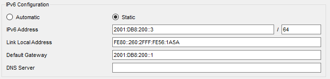

# Trabajo Práctico N°4
# Ruteo externo dinámico y sistemas autónomos.

**Nombres**  
_Elly I Esparza;_  
_Federica Mayorga;_  
_Ignacio Delamer;_  
_Ignacio A Rivarola_  
**Wi-Fighters**

**Universidad Nacional de Córdoba - FCEFyN**  
**Redes de Computadoras**  
**Profesores**  
Facundo N Oliva Cuneo  
Santiago M Henn  
**Fecha**
08/05/25  

---

### Información de los autores
 
- **Información de contacto**: _elly.indra.esparza@mi.unc.edu.ar_,  _federica.mayorga@mi.unc.edu.ar_,  _ignaciodelamer@mi.unc.edu.ar_,  _ignacio.rivarola@mi.unc.edu.ar_  

---

## Resumen  
El objetivo de este trabajo práctico es abordar el estudio del ruteo externo dinámico a través del protocolo **BGP** (Border Gateway Protocol) y su implementación en el contexto de Sistemas Autónomos (**AS**, Autonomous Systems). 

En una primera instancia, se realiza una investigación teórica sobre los conceptos fundamentales, como la definición de **AS**, **ASN**, funcionamiento y tipos de **BGP**, conexiones reales y casos históricos de fallos. 

En la segunda parte, se lleva a cabo una simulación práctica de una red que implementa **BGP**, incorporando **IPv6**, redistribución con **OSPF** y análisis de conectividad y comportamiento ante fallos. Este enfoque integral permite comprender tanto los fundamentos como la aplicación real del **BGP** en entornos de red complejos.

**Palabras clave**: _Border Gateway Protocol (BGP), Autonomous System (AS), ASN, Enrutamiento dinámico, IPv6, OSPF, Simulación de red, Redistribución de rutas, Packet Tracer_.

---

## Parte I - Integración de conceptos, actividades online e investigación  
## Introducción  
El primer apartado del trabajo lleva a comprender los fundamentos teóricos del ruteo entre sistemas autónomos mediante el protocolo **BGP**. Se abordan los conceptos esenciales como qué es un **AS**, cómo se identifican mediante números **ASN**, el funcionamiento del **BGP**, los tipos de mensajes que utiliza, y la diferencia entre **eBGP** e **iBGP**. Además, se analiza la infraestructura real de los **AS** a los que pertenecen distintas conexiones de red y se investiga un caso relevante de fallo en el enrutamiento **BGP**, evaluando su impacto a nivel nacional o internacional.

---

## Consignas

1)  Sobre AS:  
    1) Un _Autonomous System_ (**AS**) es un conjunto grande de redes **IP** interconectadas que operan bajo una única política de enrutamiento y que se identifican de forma unificada hacia el resto de Internet. Es uno de los componentes fundamentales de la arquitectura de Internet, que puede entenderse como una red de redes, donde cada **AS** representa una de esas grandes redes independientes.  
    Cada **AS** tiene asignado un conjunto específico de direcciones **IP**, conocido como su espacio de direcciones **IP**, y administra la entrega de datos dentro de ese espacio. Por fuera de sus límites, se encarga de intercambiar rutas y datos con otros **AS** utilizando protocolos de ruteo como el **BGP**.  
    Generalmente, un AS está operado por una única entidad de gran escala, como un proveedor de servicios de Internet (**ISP**), una universidad, una empresa tecnológica o una agencia gubernamental. En caso de que una red esté conectada solo a un **AS** y comparta su política de ruteo, puede considerarse simplemente una subred dentro de ese **AS**.

    2) Un _Autonomous System Number_ (**ASN**) es un número único que identifica oficialmente a cada **AS** en Internet. Su función principal es permitir que un **AS** sea reconocido y referenciado por otros sistemas cuando intercambian información de ruteo mediante protocolos como **BGP**. Cada **AS** cuenta con un **ASN** que lo distingue dentro del conjunto global de redes interconectadas.  
    Los **ASN** pueden ser de 16 bits, con valores que van desde el 1 al 65534, o de 32 bits, con un rango entre 131072 y 4294967294. Se presentan en el formato AS(número), por ejemplo, AS13335 (es el ASN de Cloudflare).  
    El uso de un **ASN** es indispensable cuando un **AS** necesita comunicarse con otros **AS**, es decir, para el enrutamiento externo. En cambio, los routers y dispositivos internos de un **AS** no necesitan necesariamente conocer ese número, ya que operan únicamente dentro del mismo sistema autónomo.

    3) Universidad Nacional de Córdoba (**UNC**):
       - ASN: AS27790
       - Asignado por: **LACNIC** (Registro de Direcciones de Internet para América Latina y el Caribe)
       - Descripcion: permite a la **UNC** gestionar su política de enrutamiento y conectividad con otras redes académicas y proveedores de servicios de Internet. Este número identifica a la universidad como un sistema autónomo dentro de la infraestructura global de Internet.
        
       
       Google LLC
       - ASN: AS15169
       - Asignado por: **ARIN** (American Registry for Internet Numbers)
       - Descripción: Este **ASN** es utilizado por Google para gestionar su vasta infraestructura global, incluyendo servicios como Google Search, Gmail, YouTube y Google Cloud Platform.​
        

       **ARSAT** – Empresa Argentina de Soluciones Satelitales S.A.
       - ASN: AS52361
       - Asignado por: **LACNIC** (Registro de Direcciones de Internet para América Latina y el Caribe)
       - Descripción: es una empresa estatal argentina que brinda servicios de telecomunicaciones, incluyendo conectividad satelital, transporte de datos y servicios mayoristas de Internet. Su **ASN** le permite operar su propia política de enrutamiento y conectarse con otros sistemas autónomos, facilitando la gestión de su infraestructura de red a nivel nacional.
    
    4) Para determinar el número de sistema autónomo (**ASN**) correspondiente a la conexión actual, se utilizó la herramienta Hurricane Electric BGP Toolkit[1], que proporciona información sobre la dirección **IP** de origen y su asociación con un **ASN**. Observable en la _Figura 1_.  
    De acuerdo con el análisis, la conexión actual utiliza la dirección **IP** pública 181.89.220.125, la cual pertenece al **ASN** AS7303, correspondiente a la empresa Telecom Argentina S.A., uno de los principales proveedores de servicios de Internet en el país.
      
    Esta organización anuncia más de 8 millones de direcciones **IPv4** y más de 100 prefijos **IPv6**, lo que refleja su amplia infraestructura de red. Su presencia geográfica se concentra principalmente en Argentina, aunque cuenta con conectividad extendida en otros países de Sudamérica. El protocolo de enrutamiento que utiliza para intercambiar rutas con otros sistemas autónomos es **BGP**. Observable en la _Figura 2_.
      
    En cuanto a los protocolos soportados se utilizó información brindada por PeeringDB [2], que confirma admite tanto **IPv4** como **IPv6**, pero no se especifica públicamente el soporte para multicast, lo cual puede indicar que podría estar implementado en algunos contextos específicos, pero no forma parte de sus capacidades anunciadas de forma abierta. Además, mantiene múltiples relaciones de peering con otros **AS**, lo que le permite garantizar una conectividad eficiente y estable a nivel regional e internacional, observable en _Figura 3_.
    

        
       <em>Figura 1: Número de ASN de la conexión.</em>
        
    

    
    

        
       <em>Figura 2: Información relevante de la empresa Telecom.</em>
        
    

    
    

        
       <em>Figura 3: Protocolos soportados.</em>
        
    

2) Sobre **BGP**:
   1) El Border Gateway Protocol (**BGP**) es un protocolo esencial para el funcionamiento de Internet, ya que se encarga de determinar las mejores rutas para la transmisión de datos entre redes independientes conocidas como **AS**. Dado que Internet está compuesto por miles de redes interconectadas —públicas, privadas, corporativas y gubernamentales—, el **BGP** actúa como un sistema de coordinación que permite que los datos encuentren el camino más eficiente desde su origen hasta su destino, incluso si deben atravesar múltiples **AS** en el proceso.
     
   Cada **AS** utiliza **BGP** para anunciar qué direcciones **IP** administra y con qué otros **AS** está conectado. Esta información se recopila en las tablas de enrutamiento **BGP**, que los routers consultan para decidir la mejor ruta que debe seguir cada paquete de datos.

   2) El _Border Gateway Protocol_ (**BGP**) es el protocolo encargado de decidir por qué rutas viajan los datos a través de Internet. Esto se logra mediante el intercambio de información de enrutamiento entre dispositivos llamados pares BGP o BGP speakers, que operan en los límites de cada **AS**. **BGP** tiene como objetivo encontrar las mejores rutas disponibles, actualizarse dinámicamente ante cambios en la red, y respetar políticas de enrutamiento definidas por cada organización.
     
   - Adquisición de vecino
     - El proceso comienza con la adquisición de vecino, que ocurre cuando dos routers **BGP** establecen una conexión **TCP** entre ellos. Luego intercambian mensajes OPEN para identificarse, verificar compatibilidades y negociar parámetros como el **ASN** y el tiempo de espera (Hold Time). Si ambas partes aceptan los términos, se forma una sesión **BGP** activa entre los dos routers, ahora considerados vecinos.
     
   - Detección de vecino alcanzable
     - Una vez establecida la relación, los routers mantienen viva la conexión mediante el envío periódico de mensajes KEEPALIVE. Si uno de los routers no recibe este mensaje dentro del tiempo establecido por el Hold Time, se considera que el vecino no está disponible y se cierra la sesión **BGP**. Esto permite detectar en forma eficiente la pérdida de conectividad con un vecino.
     
   - Detección de red alcanzable
     - Cada router **BGP** anuncia a sus vecinos las rutas que conoce mediante mensajes UPDATE. Estos contienen información sobre redes alcanzables (NLRI, Network Layer Reachability Information) y atributos como el costo, número de saltos o la política de enrutamiento. Esta información es almacenada en tablas de enrutamiento que cada router mantiene y actualiza constantemente. Así, el protocolo permite detectar qué redes están accesibles en todo momento, y ajustar el tráfico hacia rutas válidas y óptimas.
     
   - Tipos de mensajes principales[3] que **BGP** utiliza para comunicarse:
     - OPEN: inicia una sesión **BGP** entre vecinos.
     - UPDATE: anuncia nuevas rutas o retira rutas obsoletas.
     - KEEPALIVE: mantiene la sesión activa entre routers.
     - NOTIFICATION: se envía cuando ocurre un error en la sesión.
     - ROUTE-REFRESH: permite solicitar una actualización de rutas sin reiniciar la sesión.
     
   - El formato de paquetes **BGP**, comparten una cabecera de 19 bytes que incluye:
     - Marker (16 bytes): usado para autenticación.
     - Length (2 bytes): indica la longitud total del mensaje.
     - Type (1 byte): especifica el tipo de mensaje (OPEN, UPDATE, etc.).  
     
   El cuerpo del mensaje varía según su tipo e incluye datos como **ASN**, prefijos **IP**, atributos de ruta, o códigos de error en caso de notificaciones.
     
   3) El **BGP** puede clasificarse en dos tipos según el contexto en el que se utilice:
      - **eBGP** (BGP externo): se utiliza para intercambiar información de enrutamiento entre diferentes **AS**. Es el mecanismo principal por el cual las redes en Internet comparten rutas y se conectan entre sí. Las rutas aprendidas a través de eBGP se propagan a todos los pares, tanto internos como externos.
      - **iBGP** (BGP interno): opera dentro de un mismo **SA**. Se utiliza para distribuir la información de rutas aprendidas desde **eBGP** a todos los routers internos del **AS**. Por diseño, **iBGP** no redistribuye automáticamente las rutas aprendidas a otros pares **iBGP**, por lo que se requiere una arquitectura de malla completa o el uso de mecanismos como route reflectors. **iBGP** permite que un **AS** administre su política interna de ruteo sin alterar lo que se comunica externamente.   

      La diferencia principal está en cómo se propagan las rutas:
        - Rutas aprendidas por eBGP se propagan a todos los peers (iBGP y eBGP).
        - Rutas aprendidas por iBGP se propagan solo a peers eBGP, no a otros peers iBGP.

      Un AS de tránsito es aquel que no solo intercambia tráfico con sus propias redes, sino que también transporta tráfico entre otros AS.
         
      En la _Figura 4_, observamos que el AS2 es el SA de tránsito. Esto se debe a que los datos que viajan desde AS1 hacia AS3 (o viceversa) deben pasar a través del AS2, sin tener origen ni destino final en él. El AS2, entonces, actúa como intermediario, reenviando tráfico entre dos AS externos.

      

          
         <em>Figura 4: AS de tránsito.</em>
          
      

   4) Para ver las conexiones del AS actual utilizamos la herramienta bgpview.io estando conectados a la red de la universidad podemos observar el siguiente mapa de conexiones:

   

          
         <em>Figura 5: Gráfico de conexiones externas BGP UNC.</em>
          
      

      
    Este mapa nos muestra las eBGP *upstream*  con las que se está directamente conectada (termino no estandarizado posiblemente referido a "AS que le proveen un servicio", luego *downstream* sería "AS a los que se les provee un servicio) y un árbol de conexiones que parte de las mismas. Desde la ventana principar observamos que la red tiene 5 *peers* IPv4 y 3 *peers* IPv6, aunque viendo a más detalle estos últimos 3 se corresponden a los mismos proveedores de algunas de las anteriores 5 que permiten conexiones con ambos protocolos.

   

          
         <em>Figura 6: eBGP IPv4 de la AS UNC.</em>
          
      
    
      
   

          
         <em>Figura 7: eBGP IPv6 de la AS UNC.</em>
          
      
    
    
   
   5) Realizando el mismo procedimiento con la red 4G se obtiene está información:
   
      

          
         <em>Figura 8: BGP info 4G.</em>
          
      

   Donde se observa desde ya que la red tiene muchos más peers.
     
   Observando el mapa de conexiones upstream observamos algunas similitudes:
   
      

          
         <em>Figura 9: Árbol de conexiones BGP red 4G.</em>
          
      

   
   Específicamente se observa:
   
     - **AS2497** - Internet Initiative Japan Inc.
     - **AS174** - Cogent Communications
     - **AS209** - CenturyLink Communications, LLC
     - **AS3549** - Level 3 Parent, LLC
     - **AS7018** - AT&T Enterprises, LLC
   
   Todas estas se corresponden a AS de tránsito o **Tier 1** que son AS que proveen servicios de tránsito a nivel global.
   
   6) El 23 de Abril 1997 a las 11:14a.m. EDT ocurrió un fallo producido por un router de *MAI Network Services* bajo el AS7007 filtrando tablas de enrutamiento internas al internet. Esto produjo que los AS externos llenaran sus tablas de enrutamiento con las mas de 50000 direcciones proveídas por AS7007 que al ser más específicas BGP las consideró más óptimas, redirigiendo una gran parte del tráfico del internet a AS7007 saturando la red y creando un agujero negro (Punto en la red donde los paquetes se descartan sin informar al origen que el mensaje no fue recibido).
     
      El problema fue causado según MAI Network Servicies por un bug interno del que no se tienen muchos detalles, pero si se pueden estudiar las consecuencias. Dado que las IP internas usaban prefijos */24* eran más específicas que las direcciones típicas del nivel de red en el que ocurrió el error, esto como ya se mencionó produjo que fueran rutas preferentes, y los routers externos no descartaban la ruta manteniendo la situación en el tiempo.
     
       Incluso cuando el router original fue desconectado el error persistió debido a las rutas persistiendo el routers externos y los routers internos de AS7007 posiblemente siendo incapaces de notificar el cambio por el gran nivel de tráfico que les llegaba. EL problema se soluciono apagando/reiniciando los puertos afectados y agregando filtros a la entrada para recuperar el funcionamiento interno de la red.
   

---

## Parte II - Simulaciones y análisis  
## Introducción  
En la segunda parte, se traslada el conocimiento teórico a una implementación práctica mediante la simulación de una red que interconecta múltiples sistemas autónomos utilizando BGP. Se emplea un entorno virtual, para construir la topología de red, verificar conectividad entre hosts, introducir configuraciones para IPv6 y realizar pruebas de redistribución de rutas con OSPF. Buscamos analizar el comportamiento del protocolo ante distintos eventos como caídas de routers o cambios en la topología, reforzando así la comprensión del funcionamiento de BGP en escenarios reales y dinámicos.

---

## Consignas

1\)

A continuación mostraremos los respectivos comandos y explicaremos lo que hacen cada uno.
  
- `show ip bgp`: Muestra el estado de la sesión BGP en el router, incluyendo las rutas BGP aprendidas, las conexiones establecidas con otros routers BGP, y detalles sobre la tabla de rutas BGP. 

        
       <em>Figura 10: Comando show ip bgp.</em>
        
    

    
- `show ip route`: Muestra la tabla de rutas IP del dispositivo, mostrando las rutas que el router ha aprendido, ya sea de manera estática, dinámica o directamente conectada, con detalles sobre la fuente de cada ruta y su estado.  

        
       <em>Figura 11: Comando show ip route.</em>
        
    

- `show ip bgp summary`: Muestra un resumen del estado de las sesiones BGP, incluyendo el número de rutas y el estado de la vecindad.

        
       <em>Figura 12: Comando show ip bgp summary.</em>
        
    

  

El fragmento de salida que evidencia es BGP, se muestra a continuación:  

        
       <em>Figura 13: Fracción de lo observado en la Figura 11.</em>
        
    

 

En la salida de ``show ip route`` de la _Figura 11_ y la _Figura 13_, se puede identificar que una ruta fue aprendida a través de BGP por el prefijo ``B`` al principio de la línea. Explicaremos un poco más en detalle:

``B 192.168.2.0/24 [20/0] via 10.0.0.2, 00:00:00``

Esto indica que la red ``192.168.2.0/24`` fue aprendida mediante el protocolo BGP (el prefijo B en la tabla de ruteo). La información entre corchetes (``[20/0]``) refleja la distancia administrativa y la métrica de la ruta. En este caso:

- ``20`` es la distancia administrativa por defecto para rutas BGP externas (eBGP).

- ``0`` es la métrica interna de la ruta, que indica cuán preferida es esta ruta dentro de la red.

La dirección ``10.0.0.2`` es el siguiente salto hacia la red de destino y ``00:00:00`` indica que esta ruta fue aprendida recientemente.

 

La tabla de ruteo muestra todas las rutas conocidas por el router, las cuales pueden provenir de diferentes fuentes (conectadas, estáticas, o dinámicas, como BGP). En la figura X tenemos:

- **`C 10.0.0.0 is directly connected, FastEthernet0/0`**: Esta línea indica que la red 10.0.0.0/24 está directamente conectada al router a través de la interfaz FastEthernet0/0. El prefijo `C` (Connected) señala que es una red local al router, accesible sin necesidad de ruteo adicional.

- **`C 192.168.1.0/24 is directly connected, FastEthernet0/1`**: De forma similar a la anterior, esta entrada muestra que la red 192.168.1.0/24 también está directamente conectada al router, en este caso a través de la interfaz FastEthernet0/1. Probablemente sea la red donde está conectado un host local.

- **`B 192.168.2.0/24 [20/0] via 10.0.0.2, 00:00:00`**:  Esta línea representa una ruta aprendida mediante BGP (prefijo `B`). La red de destino es 192.168.2.0/24, y para alcanzarla el router debe reenviar el tráfico al siguiente salto, que es la dirección IP 10.0.0.2.  

2\) 

Para comprobar la conexión entre los AS, realizamos el comando ``ping`` desde un host en el AS1 (PC0) hacia un host en el AS2 (PC2).

        
       <em>Figura 14: Conectividad entre AS1 y AS2.</em>
        
    

El ping exitoso entre PC0 en AS1 y PC2 en AS2 demuestra que la conectividad entre los hosts de los diferentes AS está funcionando correctamente, y el tráfico es capaz de viajar a través de los routers que interconectan los dos sistemas autónomos.

3\)

En este escenario, hemos realizado una simulación de tráfico ICMP entre los hosts PC0 (en AS1) y PC3 (en AS2). A continuación, se describe el comportamiento observado al apagar y encender un router en la red.

**Router encendido:**  
Al realiza un ping desde el PC0 al PC3, con ambos routers encendidos, observamos como el tráfico ICMP viaja correctamente a través de la red. PC0 envía el paquete, y este es encaminado a través de Router0 y Router1 hacia PC3.

        
       <em>Figura 15: Tráfico con el router encendido.</em>
        
    

La conectividad funciona con normalidad, mostrando que los routers están correctamente configurados y que BGP está en funcionamiento.  

**Router apagado:**
Observamos como el paquete enviado desde PC0, llega al Router0, pero este no puede llegar al destino debido a que el Router1 fue apagado. El paquete llega hasta Router0, pero como no puede encontrar una ruta válida hacia Router1, el paquete se pierde.

        
       <em>Figura 16: Tráfico con el router apagado.</em>
        
    

Observando en el command prompt del PC0, se nos indica lo siguiente

        
       <em>Figura 17: Respuesta al comando con el router apagado.</em>
        
    

En conclusión podemos decir que:

En modo simulación, se generó tráfico ICMP entre los hosts de diferentes AS. Al apagar el router perteneciente al AS200, la tabla de ruteo de R1 eliminó la ruta BGP hacia la red y el tráfico se perdió. Tras volver a encender, BGP restableció la vecindad y la ruta fue reinstalada. La conectividad se restableció automáticamente, demostrando la tolerancia a fallos del protocolo BGP.

4\)

Se explicarán las configuraciones necesarias para implementar IPv6 en la infraestructura de red entre los AS100 y AS200. A continuación, se detallan los pasos principales realizados:

Se activó el soporte para IPv6 en ambos routers ejecutando el comando ``ipv6 unicast-routing``, esto permite que el router procese y enrute tráfico IPv6.  
Para verificar que IPv6 quedó activado correctamente, se utilizó el comando ``show running-config | include ipv6 unicast-routing``.

    
   <em>Figura 18: Habilitación de IPv6 en Routers.</em>
    

Cada interfaz de los routers fue configurada con una dirección IPv6 global del prefijo ``2001:DB8::/64``, como es común en redes de laboratorio. 

**En Router0 (AS100):**
- **FastEthernet0/0:** ``2001:0DB8:10::1/64`` (conexión al Router1)
- **FastEthernet0/1:** ``2001:0DB8:100::1/64`` (red interna con hosts)
  
**En Router1 (AS200):**
- **FastEthernet0/0:** ``2001:0DB8:10::2/64`` (conexión al Router0)
- **FastEthernet0/1:** ``2001:0DB8:200::1/64`` (red interna con hosts)
  
Para permitir el enrutamiento entre los AS, se configuraron rutas IPv6 estáticas en cada router. Con el comando ``ipv6 route 2001:0DB8:200::/64 2001:0DB8:10::2``
 y ``ipv6 route 2001:0DB8:100::/64 2001:0DB8:10::1``, respectivamente. Esto asegura que cada router conozca la ruta hacia la red interna del otro AS.  

    
   <em>Figura 19: Habilitación de enrutamiento para IPv6 en Routers.</em>
    

Luego, cada PC fue configurada con una dirección IPv6 estática, correspondiente a su red y AS, como se observa en las figuras. Cada host también fue configurado con su gateway IPv6 correspondiente.

    
   <em>Figura 20: Asignación de direcciones IPv6 en PC0.</em>
    

    
   <em>Figura 21: Asignación de direcciones IPv6 en PC1.</em>
    

    
   <em>Figura 22: Asignación de direcciones IPv6 en PC2.</em>
    

    
   <em>Figura 23: Asignación de direcciones IPv6 en PC3.</em>
    

Se realizó una prueba de conectividad con el comando ping entre los hosts de distintos AS. El resultado fue exitoso, como se observa en la Figura 24. Esto confirma que las configuraciones IPv6 fueron aplicadas correctamente, la comunicación entre los sistemas autónomos AS100 y AS200 mediante IPv6 es funcional y que las rutas estáticas IPv6 están correctamente establecidas en ambos routers.

    
   <em>Figura 24: Verificación de conectividad.</em>
    

5\)

Vemos en el desarrollo de esta tabla, la documentación de todos los dispositivos de red (routers, PCs y switches), donde se especifican sus interfaces, redes, direcciones IP (IPv4 e IPv6) y máscaras.

| Equipo |  Interfaz | IP de red |  IPv4  | Máscara |  IPv6  | Comentarios |
|------- |-----------|-----------|--------|---------|--------|-------------|
| R0 | FastEthernet0/0 | 10.0.0.0 | 10.0.0.1 | 255.255.255.0 | 2001:0DB8:10::1/64 |Enlace con router 1 (AS200) |
| R0 | FastEthernet0/1 | 192.168.1.0 | 192.168.1.1 | 255.255.255.0 | 2001:0DB8:100::1/64 | Red interna AS100 (hosts y switch0) |
| R1 | FastEthernet0/0 | 10.0.0.0 | 10.0.0.2 | 255.255.255.0 | 2001:0DB8:10::2/64 |Enlace con router 0 (AS100) |
| R1 | FastEthernet0/1 | 192.168.2.0 | 192.168.2.1 | 255.255.255.0 | 2001:0DB8:200::1/64 | Red Interna AS200 (hosts y switch1) |
| PC0 | FastEthernet0 | 192.168.1.0 | 192.168.1.2 | 255.255.255.0 | 2001:0DB8:100::2/64 | Host en AS100 |
| PC1 | FastEthernet0 | 192.168.1.0 | 192.168.1.3 | 255.255.255.0 | 2001:0DB8:100::3/64 |Host en AS100 |
| PC2 | FastEthernet0 | 192.168.2.0 | 192.168.2.2 | 255.255.255.0 | 2001:0DB8:200::2/64 | Host en AS200 |
| PC3 |FastEthernet0 |192.168.2.0 | 192.168.2.3 | 255.255.255.0 | 2001:0DB8:200::3/64 |Host en AS200 |
| SW0 | VLAN1 | N/A | N/A | N/A | N/A | Switch en AS100 |
| SW1 | VLAN1 | N/A | N/A | N/A | N/A | Switch en AS200 |

6\)

Para ampliar el AS100 integrando un nuevo router (Router2), un switch, y un host (h4), se debe garantizar su integración al dominio de enrutamiento, inicialmente mediante rutas estáticas.

Observemos que en los routers Cisco 1841, cuando se agrega el módulo HWIC-4ESW, las interfaces se tratan como puertos de switch, no como interfaces de router normales. Esto significa que no se pueden configurar directamente con ``ip address`` como se venía haciendo en una interfaz de enrutamiento normal. En lugar de eso, se debe usar una interfaz VLAN, ya que estos puertos son de capa 2. Al utilizar la interfaz VLAN, quedan como si fueran de capa 3.

    
   <em>Figura 25: Configuración en router 0 para la incorporacion del router 2.</em>
    

Realizamos las configuraciones necesarias en los router 0 y router 2.

    
   <em>Figura 26: Configuración en router 0.</em>
    

    
   <em>Figura 27: Configuración en router 2.</em>
    

Y verificamos con la configuración estática en PC4 (host 4):

    
   <em>Figura 28: Configuración estática en PC4.</em>
    

Desde PC4, se realiza un ``ping`` a su gateway ``IPv4 192.168.4.1``, comprobando conectividad directa.

    
   <em>Figura 29: Comando ping en PC4.</em>
    

Se incorporó correctamente un nuevo router (Router2), switch y host al AS100. La red 192.168.4.0/24 quedó plenamente integrada. La conectividad local está asegurada. Las pruebas confirman que h4 puede comunicarse con su gateway tanto en IPv4 como en IPv6.

7\)

Si nuestr objetivo es que todos los routers del AS100 (Router0 y Router2) compartan sus rutas internamente usando OSPF, debemos realizar las siguientes configuraciones:

    
   <em>Figura 30: Configuración OSPF en router 0.</em>
    

    
   <em>Figura 31: Configuración OSPF en router 2.</em>
    

Ahora, para verificar los vecinos por OSPF, usamos el comando ``show ip ospf neighbor``, como vemos en la _Figura 32_.

    
   <em>Figura 32: Desde R0, se ve a R2 como vecino.</em>
    

Y para confirmar las rutas aprendidas por OSPF, usamos el comando ``show ip route``, vemos desde el router 0:

    
   <em>Figura 33: Comando show ip route en router 0.</em>
    

8\)

En esta etapa, se redistribuyeron las rutas OSPF internas del AS100 en BGP a través de Router0. Esto permite que las redes que pertenecen a Router2 y a la red de PC4  sean visibles y accesibles desde el AS200.

La redistribución se configuró con el comando ``redistribute ospf 1`` dentro del proceso BGP de Router0.

    
   <em>Figura 34: Comando redistribute ospf 1 en router 0.</em>
    

En Router1 perteneciente a AS200, al ejecutar ``show ip route``, se observan entradas BGP hacia redes del AS100. Esto indica que la redistribución fue exitosa.

    
   <em>Figura 35: Comando show ip route en router 1.</em>
    

El router que actúa como punto de redistribución entre protocolos es Router0, ya que participa tanto en OSPF (internamente) como en BGP (externamente).

9\)

Se verifica la conectividad entre el host h4 (PC4) incorporado al AS100 y los hosts del AS200. Gracias a la redistribución de rutas OSPF en BGP realizada en Router0, los routers del AS200 pudieron acceder a la red ``192.168.4.0/24``.

    
   <em>Figura 36: Comando ping en PC4.</em>
    

Se comprobó conectividad IPv4 e IPv6 entre h4 y los hosts de AS200 mediante comandos ping. Los resultados positivos confirmaron que las rutas fueron correctamente compartidas y que el diseño final del sistema autónomo es funcional.

## Resultados

## Discusión y conclusiones

[1] Hurricane Electric BGP toolkit Home [Hurricane Electric]([LINK](https://bgp.he.net/))
[2] PeeringDB [PeeringDB]([LINK](https://www.peeringdb.com/))
[3] RFC 4271 [The Internet Society]([LINK](https://datatracker.ietf.org/doc/html/rfc4271))
