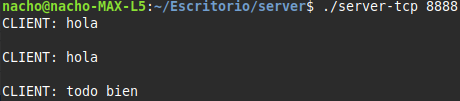
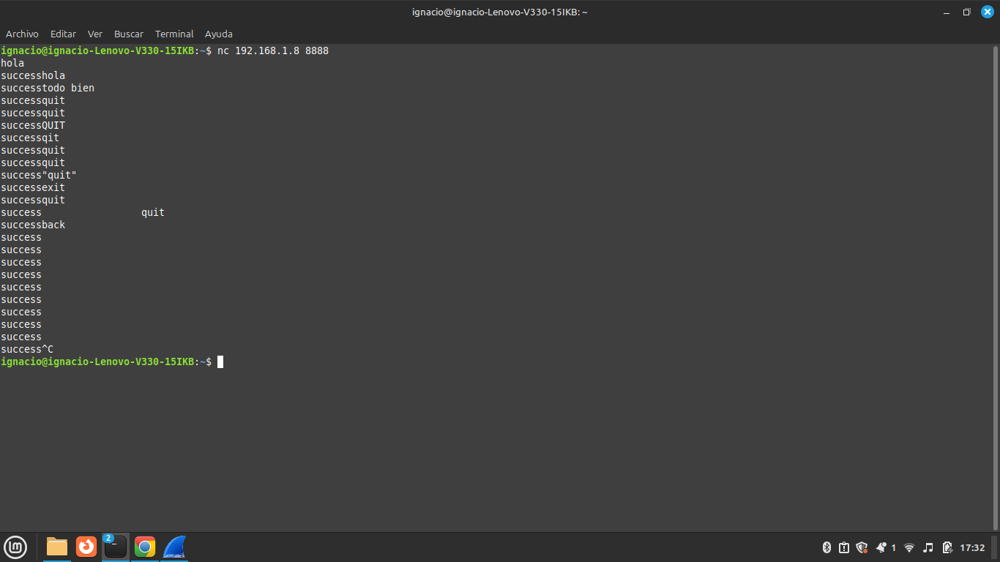
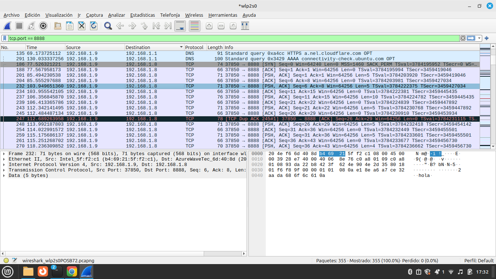
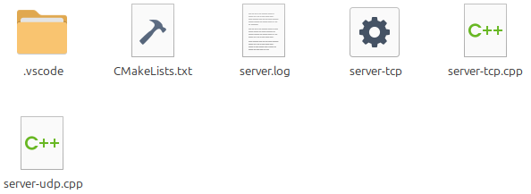
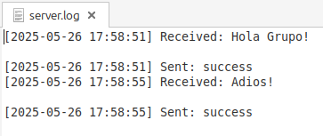
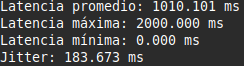
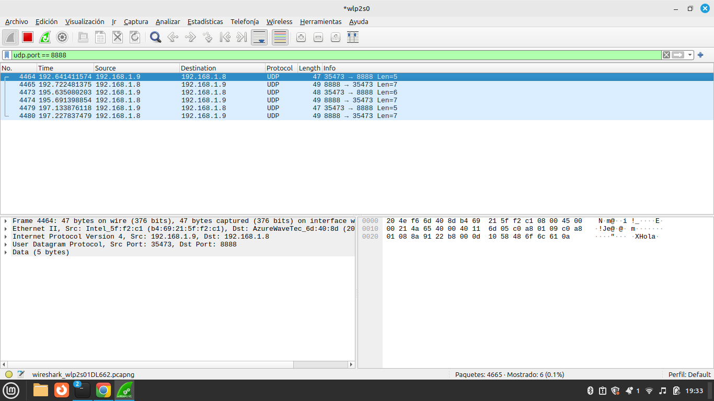
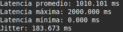

# Trabajo Práctico N°5
# Sockets

**Nombres**  
_Elly I Esparza;_  
_Federica Mayorga;_  
_Ignacio Delamer;_  
_Ignacio A Rivarola_  
**Wi-Fighters**

**Universidad Nacional de Córdoba - FCEFyN**  
**Redes de Computadoras**  
**Profesores**  
Facundo N Oliva Cuneo  
Santiago M Henn  
**Fecha**
25/05/25

---

### Información de los autores

- **Información de contacto**: _elly.indra.esparza@mi.unc.edu.ar_,  _federica.mayorga@mi.unc.edu.ar_,  _ignaciodelamer@mi.unc.edu.ar_,  _ignacio.rivarola@mi.unc.edu.ar_

---

## Resumen  

Lorem ipsum dolor sit amet, consectetur adipiscing elit, sed do eiusmod tempor incididunt ut labore et dolore magna aliqua. Ut enim ad minim veniam, quis nostrud exercitation ullamco laboris nisi ut aliquip ex ea commodo consequat. Duis aute irure dolor in reprehenderit in voluptate velit esse cillum dolore eu fugiat nulla pariatur. Excepteur sint occaecat cupidatat non proident, sunt in culpa qui officia deserunt mollit anim id est laborum.

---

## Consignas

1) Desarrollar scripts para enviar y recibir secuencialmente y a intervalos de tiempo configurables paquetes TCP con contenido identificatorio único (puede ser el nombre del grupo más un número incremental). En general se utiliza un script “server” y un script “cliente”. Podés usar el lenguaje de programación que prefieras (librerías net, socket son buenos lugares para empezar).

Tanto el programa cliente como servidor se realizaron con c++, los archivos fuente se pueden encontrar en los directorios *client* y *server* respectivamente. Para compilar se puede utilizar el script que viene incluido en este mismo directorio *build.sh*, tener en cuenta que el mismo espera que ya tengamos instalado cmake y make.

Una vez compilados, los ejecutables se encontrarán en una nueva carpeta *build*, para ejecutar el servidor se debe usar:

```bash
./build/server/server-tcp <puerto>
```

Indicando el puerto que usará el servidor.

Para ejecutar el cliente se debe usar:

```bash
./build/client/client-tcp <host> <puerto> <iteraciones> <ms>
```

Donde:
	- **host**: dirección del servidor, puede ser tanto IPv4 como IPv6 ya que el servidor acepta conexiones de ambos tipos (aunque está configurado internamente en IPv6) y el cliente usará el tipo de host que se pase como argumento para deducir automáticamente si será IPv4 o IPv6.
	- **puerto**: debe ser el mismo puerto que se uso en el servidor.
	- **iteraciones**: El cliente enviará el mensaje "WI-Fighters-i" reemplazando i por un número que se incrementará por cada mensaje. El argumento iteraciones indica cuantos mensajes se enviarán.
	- **ms**: milisegundos entre mensajes que envía el cliente.

   a) Al probar los scripts y capturar el trafico observamos lo siguiente
   Del lado del servidor podemos observar que el recibe le mensaje que el cliente le envia:
   <p><br></p>
   Ahora observamos la manera en la que el cliente envia el mensaje:
   <p><br></p>
   Capturando el paquete con wireshark lo observamos de la siguiente manera:
   <p><br></p>

   b) A continuacion presentamos imagenes del log guardando registro de los mensajes
   Log creado:
   <p><br></p>
   Revision del log:
   <p><br></p>

   c) Enviamos 100 mensajes de "hola" mediante un script de la terminal, y realizamos los calculos con un script de python. 
   A raiz de esto podemos observar los siguientes resultados:
   <p><br></p>

2) Desarrollar un script análogo al punto anterior, pero para protocolo UDP. Repetir los ítems a), b) y c).

Los archivos fuente para el cliente y servidor en UDP también se encuentran en las mismas carpetas *client* y *server* y se compilan al ejecutar el mismo script *build.sh* para ejecutar el servidor se usa:

```bash
./build/server/server-udp <puerto>
```

Y para el cliente:

```bash
./build/client/client-udp <host> <puerto> <iteraciones> <ms>
```

Los argumentos son los mismos que sus contrapartes en TCP


   a) Al probar los scripts y capturar el trafico con Wireshark observamos lo siguiente 
   <p><br></p>

   b) De la misma manera que para TCP, creamos un log "server_udp.log".

   c) Enviamos 100 mensajes de "hola" mediante un script de la terminal, y realizamos los calculos con un script de python. 
   A raiz de esto podemos observar los siguientes resultados:
   <p><br></p>


3) HACER: Comparar un paquete UDP y un paquete TCP capturados, mostrar las diferencias y elaborar una tabla comparativa para las métricas obtenidas en el punto C.

4) Sobre encriptación:
   a) Investigar y desarrollar brevemente las diferencias entre encriptado simétrico y asimétrico.
   
   **Encriptado simétrico** - Consiste en utilizar una única clave privada tanto en el transmisor para encriptar el mensaje como en el receptor para desencriptarlo. Es un método más fácil y rápido pero presenta la complicación de compartir la clave con la otra parte de forma segura.
   
   **Encriptado asimétrico** - Se utilizan 2 claves, una pública que se comparte con el transmisor para que encripte sus mensajes y otra privada que se mantiene protegida en el receptor. La clave privada se compara con la pública para verificar su valides y se utiliza para desencriptar el mensaje si se determina que la clave pública utilizada es válida. Es un proceso más lento y complejo pero más seguro.
   
   b) Investigar sobre librerías para encriptar mensajes, e implementar la que más te guste en los scripts que desarrollaste (encriptar la carga útil), podés usar cualquier tipo de encriptación que quieras: sobre la que elegiste, resumí las principales características.
   
   Para este punto se utilizó la librería `sodium` que otorga múltiples métodos de encriptación. De todos los métodos de encriptación se utilizó el más simple, **xSalsa20**.
   
   xSalsa20 es un cifrado *simétrico* en el cual se produce una clave secreta de 32 bytes conocida por el cliente y el servidor. Luego el cliente genera un valor aleatorio de 24 bytes llamado *nonce* (number used once) que se utiliza junto a la clave para cifrar el mensaje entes de transmitirlo, luego el servidor recibe el nonce y lo combina con la clave para descifrar el mensaje. El nonce es una medida de seguridad ya que si solo se utiliza la clave privada un observador podría reconocer patrones en los mensajes y descifrar cuál es la clave privada, pero como a la clave se le agrega un nonce aleatorio para cada mensaje el observador no podrá detectar ningún patrón (siempre y cuando no se reutilice un nonce).
   
   Además de esto la librería genera un código de autenticación de mensaje (MAC) con la función hash `Poly1305`, que genera una etiqueta de 16 bytes para autenticar el mensaje. El algoritmo funciona con una clave de un solo uso de 32 bits, que en este caso se obtiene a partir del mismo nonce y el mensaje cifrado, de modo que al cambiar el nonce no solo cambia la clave que utiliza xSalsa20, sino que también cambia el hash de Poly1305.
   
   c) HACER: Ejecutar los scripts, tomar un paquete aleatorio de la secuencia e identificar la carga útil del mismo. Mostrar que la misma se encuentra encriptada, comparando con las tramas obtenidas en los ítems 1)a) y 2)a)

   d) HACER: ¿Cómo harías para encriptar la comunicación entre las dos computadoras si las mismas se encuentran a kilómetros de distancia y nunca intercambiaron información en el pasado? Explicar conceptualmente cómo implementarías esto en tus scripts (pero no hace falta que lo programes).


## Resultados

Lorem ipsum dolor sit amet, consectetur adipiscing elit, sed do eiusmod tempor incididunt ut labore et dolore magna aliqua. Ut enim ad minim veniam, quis nostrud exercitation ullamco laboris nisi ut aliquip ex ea commodo consequat. Duis aute irure dolor in reprehenderit in voluptate velit esse cillum dolore eu fugiat nulla pariatur. Excepteur sint occaecat cupidatat non proident, sunt in culpa qui officia deserunt mollit anim id est laborum.
