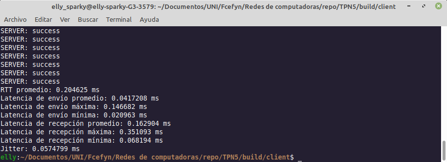
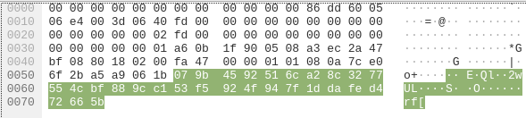

# Trabajo Práctico N°5 - Sockets

**Nombres**  
_Elly I Esparza;_  
_Federica Mayorga;_  
_Ignacio Delamer;_  
_Ignacio A Rivarola_  
**Wi-Fighters**

**Universidad Nacional de Córdoba - FCEFyN**  
**Redes de Computadoras**  
**Profesores**  
Facundo N Oliva Cuneo  
Santiago M Henn  
**Fecha**
29/05/25

---

### Información de los autores

- **Información de contacto**: _elly.indra.esparza@mi.unc.edu.ar_,  _federica.mayorga@mi.unc.edu.ar_,  _ignaciodelamer@mi.unc.edu.ar_,  _ignacio.rivarola@mi.unc.edu.ar_

---

## Resumen  

El objetivo de este trabajo es profundizar en el uso de la capa de transporte en redes de computadoras, mediante el desarrollo y análisis de scripts que utilizan los protocolos TCP y UDP para el envío de mensajes identificatorios entre dos computadoras. Se implementaron versiones cliente-servidor que permiten configurar la frecuencia de envío y se registraron métricas de latencia y jitter a partir de los mensajes intercambiados. Además, se incorporó una capa de encriptación utilizando cifrado simétrico con la biblioteca libsodium, demostrando cómo proteger la información transmitida. Finalmente, se exploraron diferencias clave entre encriptación simétrica y asimétrica, así como un enfoque conceptual para establecer comunicación segura entre computadoras sin previo intercambio de claves.

**Palabras clave**: _TCP, UDP, socket, latencia, jitter, Wireshark, encriptación simétrica, encriptación asimétrica, libsodium, networking_.

---

## Consignas

**1)** Desarrollar scripts para enviar y recibir secuencialmente y a intervalos de tiempo configurables paquetes TCP con contenido identificatorio único (puede ser el nombre del grupo más un número incremental). En general se utiliza un script “server” y un script “cliente”. Podés usar el lenguaje de programación que prefieras (librerías net, socket son buenos lugares para empezar).

Tanto el programa cliente como servidor se realizaron con C++, los archivos fuente se pueden encontrar en los directorios *client* y *server* respectivamente. Para compilar se puede utilizar el script que viene incluido en este mismo directorio *build.sh*, tener en cuenta que el mismo espera que ya tengamos instalado cmake y make.

Una vez compilados, los ejecutables se encontrarán en una nueva carpeta *build*, para ejecutar el servidor se debe usar:

```bash
cd build/server/
./server-tcp <puerto>
```

Indicando el puerto que usará el servidor.

Para ejecutar el cliente se debe usar:

```bash
cd build/client/
./client-tcp <host> <puerto> <iteraciones> <ms>
```

Donde:
- **host**: dirección del servidor, puede ser tanto IPv4 como IPv6 ya que el servidor acepta conexiones de ambos tipos (aunque está configurado internamente en IPv6) y el cliente usará el tipo de host que se pase como argumento para deducir automáticamente si será IPv4 o IPv6.
- **puerto**: debe ser el mismo puerto que se uso en el servidor.
- **iteraciones**: El cliente enviará el mensaje "WI-Fighters-i" reemplazando i por un número que se incrementará por cada mensaje. El argumento iteraciones indica cuantos mensajes se enviarán.
- **ms**: milisegundos entre mensajes que envía el cliente.

   **a)** Al probar los scripts y capturar el trafico observamos lo siguiente
   Del lado del servidor podemos observar que el recibe le mensaje que el cliente le envía:
   <p><br></p>
   
   El cliente por su parte recibe mensajes de confirmación:
   
   <p><br></p>
   
   Capturando el paquete con Wireshark lo observamos de la siguiente manera:
   
   <p><br></p>

   La carga útil del paquete seleccionado consta de los últimos 13 bytes de los 99 bytes totales. Podemos deducir esto considerando que tenemos 14 bytes de la cabecera Ethernet 2, MAC origen + MAC destino + 2 bytes indicando el tipo de protocolo de red (IPv6); luego hay 40 bytes del protocolo IPv6 y 32 de TCP, dejando solo los 13 bytes finales de carga útil (99 - 14 - 40 - 32 = 13).
   
   <p><br></p>

   **b)** A continuación presentamos imagenes del log guardando registro de los mensajes
   Log creado:
   <p><br></p>
   
   Revision del log:
   
   <p><br></p>

   **c)** Se agregó un código al final del programa cliente para calcular latencia y jitter. Enviando 100 paquetes en periodos de 1 segundo se obtuvo:
   
   <p><br></p>

   Nótese que la latencia de recepción es en promedio mayor, esto es por el tiempo extra que le toma al servidor actualizar el log.

**2)** Desarrollar un script análogo al punto anterior, pero para protocolo UDP. Repetir los ítems **a)**, **b)** y **c)**.

Los archivos fuente para el cliente y servidor en UDP también se encuentran en las mismas carpetas *client* y *server* y se compilan al ejecutar el mismo script *build.sh* para ejecutar el servidor se usa:

```bash
cd build/server/
./server-udp <puerto>
```

Y para el cliente:

```bash
cd build/client/
./client-udp <host> <puerto> <iteraciones> <ms>
```

Los argumentos son los mismos que sus contrapartes en TCP

   **a)** Al probar los scripts y capturar el trafico con Wireshark observamos lo siguiente:
   
   <p><br></p>
   
   La carga útil del paquete es nuevamente de 13 bytes (por ser el mismo mensaje) pero el paquete se redujo de 99 bytes a 75 bytes, ya que la cabecera UDP solo contiene 8 bytes en lugar de las 32 bytes de la de TCP.
   
   <p><br></p>

   **b)** De la misma manera que para TCP, creamos un log "server_udp.log".
   
   <p><br></p>

   **c)** Enviamos 100 mensajes a periodos de 1 segundo. A raíz de esto podemos observar los siguientes resultados:
   
   <p><br></p>

   Se observan valores mayores a TCP, el RTT mayor puede deberse a alguna perdida en el propio código.

**3)** Comparar un paquete UDP y un paquete TCP capturados, mostrar las diferencias y elaborar una tabla comparativa para las métricas obtenidas en el punto C.

   Desglosando los paquetes presentados en los puntos **1)a)** y **2)a)** se tiene:
   
   | Protocolo | Tamaño paquete | Tamaño encabezados |
   | --- | --- | --- |
   | TCP | 99 Bytes | 14 Bytes Ethernet II, 40 Bytes IPv6, 32 Bytes TCP, 13 Bytes carga útil |
   | UDP | 75 | 14 Bytes Ethernet II, 40 Bytes IPv6, 8 Bytes UDP, 13 Bytes carga útil |
   
   En cuanto a lo obtenido en el punto C se tiene:
   
   | Protocolo | RTT promedio | Latencia de envío promedio - Max - Min | Latencia de recepción promedio - Max - Min | Jitter |
   | --- | --- | --- | --- | --- |
   | TCP | 0.205 ms | 0.042 ms - 0.147 ms - 0.021 ms | 0.163 ms - 0.351 ms - 0.068 ms | 0.057 ms |
   | UDP | 0.235 ms | 0.049 ms - 0.107 ms - 0.028 ms | 0.187 ms - 0.480 ms - 0.095 ms | 0.082 ms |

**4)** Sobre encriptación:
   **a)** Investigar y desarrollar brevemente las diferencias entre encriptado simétrico y asimétrico.
   
   **Encriptado simétrico** - Consiste en utilizar una única clave privada tanto en el transmisor para encriptar el mensaje como en el receptor para desencriptarlo. Es un método más fácil y rápido pero presenta la complicación de compartir la clave con la otra parte de forma segura.
   
   **Encriptado asimétrico** - Se utilizan 2 claves, una pública que se comparte con el transmisor para que encripte sus mensajes y otra privada que se mantiene protegida en el receptor. La clave privada se compara con la pública para verificar su valides y se utiliza para desencriptar el mensaje si se determina que la clave pública utilizada es válida. Es un proceso más lento y complejo pero más seguro.
   
   **b)** Investigar sobre librerías para encriptar mensajes, e implementar la que más te guste en los scripts que desarrollaste (encriptar la carga útil), podés usar cualquier tipo de encriptación que quieras: sobre la que elegiste, resumí las principales características.
   
   Para este punto se utilizó la librería `sodium` que otorga múltiples métodos de encriptación. De todos los métodos de encriptación se utilizó el más simple, ``xSalsa20``.
   
   ``xSalsa20`` es un cifrado *simétrico* en el cual se produce una clave secreta de 32 bytes conocida por el cliente y el servidor. Luego el cliente genera un valor aleatorio de 24 bytes llamado *nonce* (number used once) que se utiliza junto a la clave para cifrar el mensaje entes de transmitirlo, luego el servidor recibe el nonce y lo combina con la clave para descifrar el mensaje. El nonce es una medida de seguridad ya que si solo se utiliza la clave privada un observador podría reconocer patrones en los mensajes y descifrar cuál es la clave privada, pero como a la clave se le agrega un nonce aleatorio para cada mensaje el observador no podrá detectar ningún patrón (siempre y cuando no se reutilice un nonce).
   
   Además de esto la librería genera un código de autenticación de mensaje (MAC) con la función hash `Poly1305`, que genera una etiqueta de 16 bytes para autenticar el mensaje. El algoritmo funciona con una clave de un solo uso de 32 bits, que en este caso se obtiene a partir del mismo nonce y el mensaje cifrado, de modo que al cambiar el nonce no solo cambia la clave que utiliza ``xSalsa20``, sino que también cambia el hash de ``Poly1305``.
   
   **c)** Ejecutar los scripts, tomar un paquete aleatorio de la secuencia e identificar la carga útil del mismo. Mostrar que la misma se encuentra encriptada, comparando con las tramas obtenidas en los ítems **1)a)** y **2)a)**.
   
   Repetimos el proceso original con los programas `client-tcp-e` y `server-tcp-e` que realizan la encriptación y decodificación de los mensajes
   
   <p><br></p>
   
   Capturando los paquetes en Wireshark se observa:
   
   <p><br></p>
   
   Como primer detalle, ahora se observan más paquetes, estos son los paquetes donde el cliente envía la clave *nonce*. Revisando específicamente uno de los paquetes donde de envía un mensaje se observa:
   
   <p><br></p>
   
   Donde la carga útil paso de los 13 bytes previos a 29 bytes y la traducción a ASCII que Wireshark intenta hacer no muestra el mensaje esperado, sino un conjunto de datos ilegibles, demostrando así que los datos se encuentran realmente encriptados y protegidos.

   **d)** Para un caso como el planteado, no sería posible utilizar directamente un esquema de encriptación simétrica, porque las partes no comparten una clave previa. Para resolver este problema, una opción segura y ampliamente utilizada es recurrir a encriptación asimétrica durante el inicio de la comunicación.

   Conceptualmente, una posible implementación seria la generación de claves asimétricas donde cada computadora genera un par de claves, una pública y otra privada. Seguido de un intercambio de las claves públicas, entre el cliente y el servidor al momento de establecer la conexión, en el inicio de la sesión.  
   Con esto, dar comienzo a una negociación de la clave. Usando la clave pública del servidor, el cliente puede cifrar una clave simétrica aleatoria y enviarla al servidor. Entonces, solo el servidor podrá decifrarla con su clave privada.  
   Llegando asi a una transmisión segura, porque en este momento ambos lados comparten una clave simétrica y los mensajes se cifrarían con esta clave, usando el algoritmo simétrico elegido, asegurando así la eficiencia y confidencialidad.


## Resultados

Este trabajo práctico tuvo como objetivo principal la implementación y análisis de comunicaciones en la capa de transporte utilizando los protocolos TCP y UDP, tanto en su versión sin cifrado como encriptada. Para ello, se desarrollaron scripts cliente-servidor en C++ que permitieron el envío secuencial de mensajes identificatorios a intervalos configurables, evaluando métricas como latencia, jitter y carga útil mediante el uso de herramientas como Wireshark.

Se realizaron capturas y análisis comparativos entre TCP y UDP, evidenciando diferencias en tamaño de encabezados, comportamiento en la transmisión, y desempeño general. Se implementó un sistema de log con timestamps para registrar el tráfico y calcular métricas, observándose en promedio una mayor estabilidad en TCP, pero menor carga de encabezado en UDP.

En cuanto a la seguridad, se incorporó encriptación simétrica utilizando la librería ``libsodium`` y el algoritmo ``xSalsa20``, acompañado de un nonce aleatorio para cada mensaje. Se verificó que los datos en tránsito estaban correctamente cifrados mediante inspección en Wireshark, con un aumento en la longitud de la carga útil y la imposibilidad de leer el contenido en texto plano.

Finalmente, se abordó conceptualmente el desafío de establecer una comunicación segura entre equipos sin intercambio previo de información. Se propuso utilizar encriptación asimétrica para intercambiar una clave simétrica de forma segura al inicio de la conexión, replicando el funcionamiento de protocolos como TLS. Esta propuesta complementa la implementación previa basada en claves compartidas y representa una extensión realista y escalable para escenarios distribuidos.

Este trabajo nos permitió aplicar conceptos clave de networking como sockets, análisis de tráfico, medición de rendimiento, y fundamentos de criptografía aplicada, integrando teoría y práctica en un entorno de red controlado.
